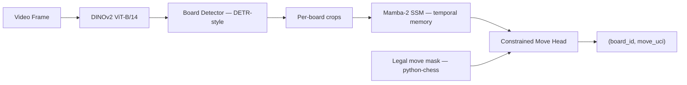
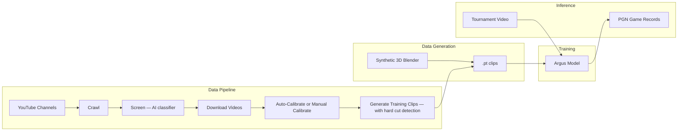
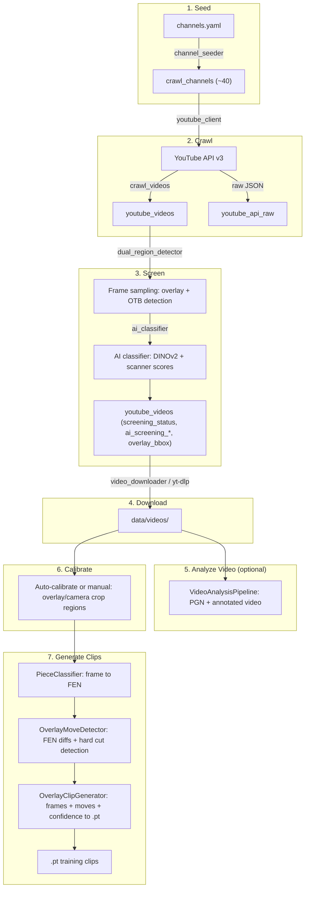
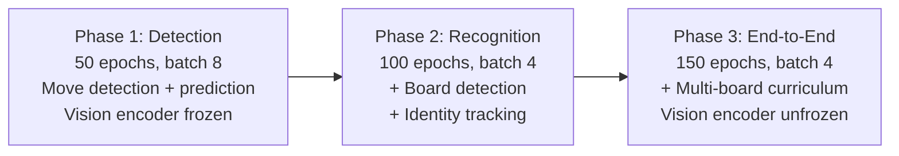
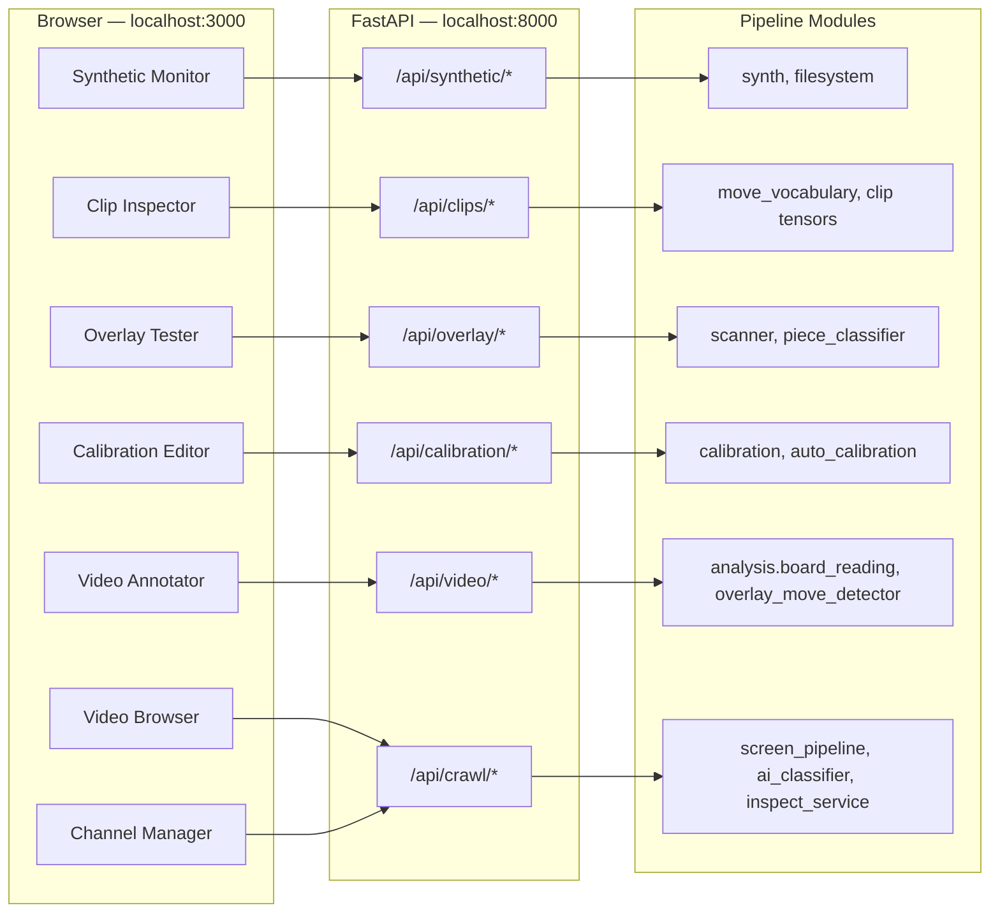
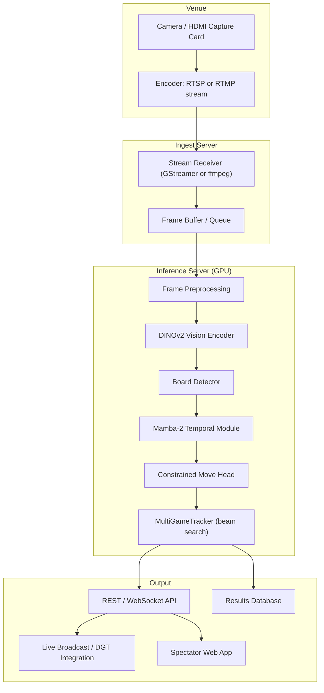
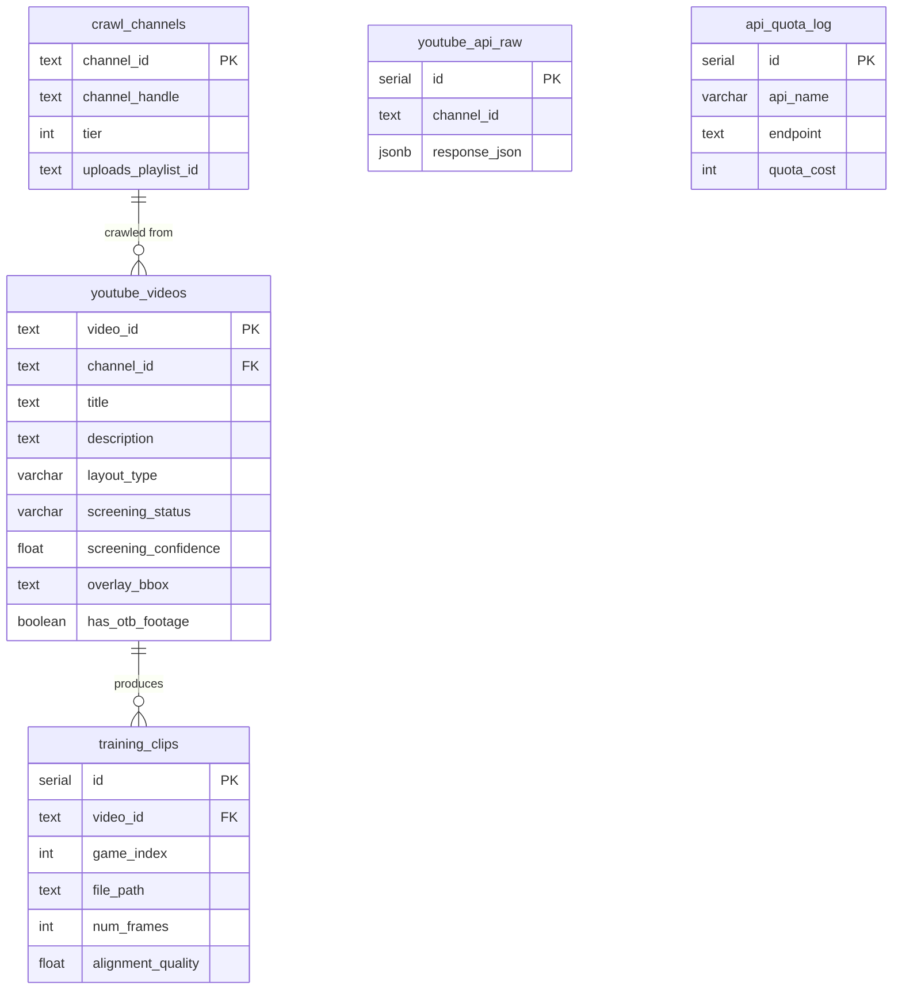

# Argus

Multi-game chess board state tracking from unconstrained video.

Argus reconstructs PGN game records from tournament video by framing move recognition as a VLA-style sequential decision problem. A single model observes video frames and emits `(board_id, move)` events, with chess legality enforced architecturally through constrained decoding — the model literally cannot output an illegal move.

---

**Table of Contents**

- [Architecture](#architecture)
- [Domains](#domains)
- [Quick Start: Training](#quick-start-training)
- [Quick Start: Data Pipeline](#quick-start-data-pipeline)
- [Quick Start: Dev Tools](#quick-start-dev-tools)
- [Data Pipeline](#data-pipeline)
- [Data Generation](#data-generation)
- [Training](#training)
- [Inference](#inference)
- [Evaluation](#evaluation)
- [Piece Classifier](#piece-classifier)
- [Developer Tools](#developer-tools)
- [Dev Tools REST API](#dev-tools-rest-api)
- [Deployment & Production Status](#deployment--production-status)
- [CLI Reference](#cli-reference)
- [Configuration](#configuration)
- [Database Schema](#database-schema)
- [Project Structure](#project-structure)
- [Key Design Decisions](#key-design-decisions)

---

## Architecture



| Component | Role |
|-----------|------|
| **Vision Encoder** | DINOv2 ViT-B/14 (frozen, then fine-tuned). Dense spatial features for board detection and piece recognition. |
| **Board Detector** | DETR-style transformer decoder with learned board queries. Outputs bounding boxes + identity embeddings, tracked across frames via Hungarian matching. |
| **Temporal Module** | Mamba-2 SSM processes per-board feature sequences in linear time, handling 4+ hour tournaments (14K+ frames). GRU fallback when CUDA unavailable. |
| **Constrained Move Head** | Projects to 1970 logits (1968 UCI moves + NO_MOVE + UNKNOWN). A legal move mask from python-chess zeros out illegal moves before softmax. |

### System Overview



---

## Domains

The codebase is organized into 5 independent domains. Pick the one you're working on — each has its own folder, dependencies, and workflow.

| Domain | Folder | Purpose | Dependencies |
|--------|--------|---------|-------------|
| **Data Pipeline** | `pipeline/` | Curate training data: crawl YouTube, screen videos, generate overlay clips | PostgreSQL, YouTube API key |
| **Data Generation** | `src/argus/datagen/`, `blender/` | Generate synthetic training clips (3D Blender rendering) | Blender 4.0+ |
| **Training** | `src/argus/model/`, `src/argus/training/`, `scripts/train.py` | Train the Argus model in 3 phases | PyTorch, GPU, Hydra |
| **Inference** | `src/argus/inference/`, `scripts/infer.py` | Run a trained model on video files to produce PGN | PyTorch, trained checkpoint |
| **Dev Tools** | `dev-tools/` | Web UI for monitoring synthetic data generation and debugging the video overlay pipeline | Docker |

Shared across domains: `src/argus/chess/` (move vocabulary, state machine, constraint masking, PGN writer).

---

## Development Setup

Requires Python 3.10+, Node.js 18+, Docker, Git LFS, Cairo, Blender 4.0+, and ffmpeg. See [CONTRIBUTING.md](CONTRIBUTING.md) for install commands and per-domain details.

### Git LFS

Committed model weights live under `weights/` and are stored with Git LFS.

```bash
brew install git-lfs   # macOS
git lfs install
git lfs pull --include="weights/screening/*,weights/overlay/*,weights/overlay_yolo/*,weights/otb_yolo/*,weights/yolo_base/*"
```

### direnv (recommended)

Auto-activates the Python virtual environment and installs dependencies whenever you `cd` into the project.

```bash
brew install direnv                              # macOS
echo 'eval "$(direnv hook zsh)"' >> ~/.zshrc     # or ~/.bashrc for bash
cd argus/ && direnv allow                        # first time only
```

After this, every new terminal that enters the project directory will have the venv active automatically — no manual `source .venv/bin/activate` or `make dev` needed.

### Without direnv

```bash
python3 -m venv .venv && source .venv/bin/activate
make dev                # install Python package + dev dependencies
make pipeline-install   # install pipeline dependencies (if working on pipeline)
```

`make dev` installs the host-side YOLO dependency (`ultralytics`). `make up` installs the same runtime dependency in the API container from `pipeline/requirements.txt`.

### Start all services

Bring up PostgreSQL, the dev-tools API, and the dev-tools UI via Docker, plus the native Blender render server:

```bash
make up       # start everything
make down     # stop everything
```

|  Service    | URL                     |
|-------------|-------------------------|
| PostgreSQL  | `localhost:5433`        |
| API         | http://localhost:8000   |
| UI          | http://localhost:3000   |
| Blender     | `localhost:9876`        |

If Blender is not installed, `make up` skips it with a warning — the other services still start.

`make up`, `make test`, and the runtime pipeline targets now fail fast if the committed model weights are missing or still Git LFS pointer files.

If you want the full chess-positions dataset locally for piece-classifier work,
run `make ensure-overlay-data` (Kaggle CLI) or install it manually under
`data/overlay/{train,val}`. The dev-tools FEN/overlay inspectors fall back to
committed fixtures when that dataset is absent.

---

## Quick Start: Training

Generate synthetic data and train a model. No database or API keys needed.

> **Tip:** `make up` starts the dev-tools UI automatically — monitor synthetic data generation live at http://localhost:3000/synthetic.

```bash
make up

# Generate synthetic training data
make datagen ARGS="--num-clips 100 --output-dir data/argus/train --image-size 64"
make datagen ARGS="--num-clips 20 --output-dir data/argus/val --image-size 64"

# Train Phase 1 (move detection)
make train ARGS="data.data_dir=data training.wandb.enabled=false"

# Or train from real-video clips prepared with split-clips
make train ARGS="data=real_clips training.wandb.enabled=false"
```

## Quick Start: Data Pipeline

Curate real training data from YouTube overlay videos. Requires Docker and a YouTube API key.

```bash
brew install cairo  # macOS — see CONTRIBUTING.md for other platforms

make up
make pipeline-install
cp .env.example .env  # Fill in DATABASE_URL, YOUTUBE_API_KEY

make seed-channels     # Load YouTube channels from channels.yaml
make crawl             # Fetch video metadata from YouTube
make screen            # Title filter + frame sampling for overlay/OTB detection

# AI-assisted screening (optional — train once, then auto-screen)
python -m pipeline ai-extract --device mps   # Pre-compute DINOv2 features (~4s/video)
python -m pipeline ai-train                  # Train classifier (saves to weights/screening/)
python -m pipeline ai-eval                   # Evaluate accuracy + calibrate threshold
python -m pipeline ai-screen --threshold 0.90  # Auto-screen new videos

# Overlay detector maintenance (default runtime detector)
python -m pipeline overlay-yolo-export       # Export bbox training labels to YOLO format
python -m pipeline overlay-yolo-train        # Train detector; validate every change with scripts/visualize_overlay_tests.py

# Committed weights live under weights/: runtime checkpoints in
# weights/screening/, weights/overlay/, weights/overlay_yolo/, and
# weights/otb_yolo/, plus YOLO bootstrap checkpoints in weights/yolo_base/.

# Auto-calibrate new channels (instead of manual bbox drawing)
python -m pipeline auto-calibrate --channel @NewChannel --apply

make download          # Fetch approved videos via yt-dlp
make generate-clips    # Overlay FEN reading + change-gated move detection → .pt training clips
make split-clips       # Video-disjoint train/val dataset under data/argus/training_dataset/
```

## Quick Start: Dev Tools

Launch the web-based inspection UI.

```bash
make up
# Backend:  http://localhost:8000
# Frontend: http://localhost:3000
```

For foreground mode (logs streaming in terminal): `make dev-tools` / `make dev-tools-down`.

This starts PostgreSQL, the FastAPI backend, and the Next.js frontend. Stop with `make dev-tools-down`.

---

## Data Pipeline

> **Domain: Pipeline** — `pipeline/`

The pipeline sources real chess games from YouTube commentary videos that include a rendered 2D board overlay (lichess, chess.com streams). It screens videos for overlay presence, reads board state directly from overlay pixels, detects moves via FEN comparison, and produces annotated training clips with frame-level move alignment.

### Pipeline Flow



### Pipeline Stages

| # | Stage | Command | What it does |
|---|-------|---------|-------------|
| 1 | Seed | `make seed-channels` | Load YouTube channels from `configs/videos/channels.yaml` into PostgreSQL |
| 2 | Crawl | `make crawl` | Fetch video metadata from ~40 YouTube channels via playlistItems API |
| 3 | Screen | `make screen` | Title keyword filter + frame sampling to detect 2D overlay and OTB camera footage |
| 3b | AI Screen | `python -m pipeline ai-screen` | DINOv2-based 3-way classifier (overlay / otb_only / reject). High-confidence auto-decides; low-confidence queued for manual review |
| 4 | Download | `make download` | Fetch approved videos via yt-dlp to `data/videos/{channel}/` |
| 5 | Analyze | `python -m pipeline.cli analyze-video` | Optional local-video analysis: board reading, PGN export, and annotated video without prior calibration |
| 6 | Calibrate | `python -m pipeline auto-calibrate` | Auto-propose calibration from screening data (theme, orientation, crop regions). Falls back to manual `calibrate` for adjustments |
| 7 | Clips | `make generate-clips` | Overlay FEN reading + move detection with hard cut detection + per-move confidence, produces `.pt` training clips |

### How Screening Works

Videos are screened in up to three passes:

1. **Title filter** — keyword matching against the video title to identify chess commentary content
2. **Dual-region detection** — frame sampling to detect both:
   - **2D overlay** — rendered board overlay (lichess, chess.com streams) via the default YOLO detector
   - **OTB footage** — over-the-board camera footage outside the detected overlay
3. **AI classifier** (optional) — a frozen DINOv2 encoder extracts features from 4 YouTube thumbnails (480x360 hq variants) per video, concatenated with overlay scanner and OTB detector scores, then a small MLP head classifies into overlay / otb_only / reject with a confidence score. Vertical videos are auto-rejected. High-confidence predictions are auto-decided; low-confidence videos are queued for manual review. Model weights are committed in `weights/screening/` with versioned filenames (e.g. `v2r1.pt`).

Screening results are stored on `youtube_videos` as `screening_status`, `screening_confidence`, `overlay_bbox`, `has_otb_footage`, plus AI metadata in `ai_screening_class`, `ai_screening_confidence`, and `ai_screening_auto_decided`.

`data/videos/ground_truth.json` and `tests/fixtures/frames/ground_truth.json` are detector training/evaluation labels for the YOLO overlay detector. Runtime overlay localization does not read those files directly.

### How Overlay Clip Generation Works

For videos with a 2D board overlay:

1. **Calibration** — per-channel layout config defines overlay crop, camera crop, reference resolution, board flip, and board theme. Can be auto-proposed via `auto-calibrate` or set manually.
2. **Overlay localization** — `detect_overlay_runtime()` runs the default YOLO detector and applies a small padding margin so the board crop does not clip outer squares.
3. **FEN reading** — `piece_classifier.py` batches all 64 squares through a tiny ONNX CNN to produce a FEN string in under 100ms on warm CPU reads. `GridDetector` handles automatic board boundary detection inside the YOLO crop.
3. **Move detection with hard cut detection** — `OverlayMoveDetector` compares FENs across frames with a stability window, using python-chess to find the legal move transforming old FEN to new FEN. Detects game resets AND hard cuts (when >4 squares change simultaneously, indicating a board switch rather than a legal move).
4. **Per-move confidence scoring** — each detected move receives a confidence score based on how many consecutive frames agreed on the FEN before and after the transition. Higher stability = higher confidence. Moves found via resync (no legal move path) get confidence 0.0.
5. **Move synchronization** — broadcast delay compensation aligns overlay moves to camera footage timestamps
6. **Clip output** — `.pt` file with `frames` (T, 3, 224, 224), `move_targets`, `detect_targets`, `legal_masks`, `move_mask`, `move_confidence`

### How Local Video Analysis Works

`analyze-video` and the dev-tools Video Annotator share the same board-reading core. The default path stays overlay-first, with optional segmentation and VLM fallbacks folded into `pipeline.analysis`.

```mermaid
graph TD
    VID[Local video] --> PIPE[VideoAnalysisPipeline]
    PIPE --> SCENE[scene backend: none | vlm]
    PIPE --> READER[reader backend: overlay | hybrid]
    READER --> OVERLAY[grid_detector + piece_classifier]
    READER --> HYBRID[board_segmenter + piece_detector + vlm]
    OVERLAY --> MOVE[overlay_move_detector + PGNWriter]
    HYBRID --> MOVE
    MOVE --> OUT[PGN + annotated video]
```

- **overlay** — current production path: runtime overlay detection + grid detection + `piece_classifier`
- **hybrid** — overlay path first, then board segmentation and direct board-reading fallbacks only when overlay reading fails
- **scene backend** — optional VLM scene summary; it does not change move detection decisions
- **runtime note** — `hybrid` and `vlm` features require optional local vision-language dependencies

### Overlay Components

| Module | What it does |
|--------|-------------|
| `scanner.py` | Runtime entry points `runtime_overlay_check()` and `detect_overlay_runtime()` use the committed YOLO detector. Legacy heuristic `fast_overlay_check()` / `detect_overlay_fast()` remain in the file for training-label tooling and detector bootstrapping. |
| `piece_classifier.py` | Tiny ONNX per-square piece classifier. Reads all 64 squares in one batch, applies empty-square suppression / king-count repair, and supports partial square reclassification for locked overlays. |
| `sequence_reader.py` | Locks board geometry once, computes cheap per-square deltas, skips unchanged frames, and only re-reads candidate move transitions or periodic resync frames. |
| `grid_detector.py` | Detects the 8x8 board grid using Sobel edge projection with HoughLinesP fallback. Handles borders and coordinate labels. |
| `yolo_detector.py` | Loads the committed default YOLO overlay detector weights from `weights/overlay_yolo/`. |
| `yolo_dataset.py` | Exports bbox training labels from `data/videos/ground_truth.json` and fixture labels into a YOLO dataset. |
| `yolo_train.py` | Trains the YOLO overlay detector. Defaults to `weights/yolo_base/yolo11n.pt`; validate every change with `scripts/visualize_overlay_tests.py`. |
| `overlay_move_detector.py` | Compares FENs across frames with a stability window. Uses python-chess to find the legal move transforming old FEN to new FEN. Detects game resets and hard cuts (>4 squares changed = board switch). Assigns per-move confidence scores. |
| `calibration.py` | Stores per-channel layout configs: overlay crop, camera crop, reference resolution, board flip, board theme. Persisted in `configs/annotate/overlay_layouts.yaml`. |
| `auto_calibration.py` | Auto-proposes calibration from YouTube thumbnails: detects board theme (color sampling), orientation (piece distribution), and camera region (largest non-overlay area). |
| `overlay_clip_generator.py` | Combines camera crops with overlay-detected moves to produce `.pt` files. Uses locked-grid change gating, broadcast delay compensation, per-move confidence scores, and emits PGN/timing metadata alongside frame tensors. |
| `diagnostics.py` | `test_image()`, `test_reader()`, `inspect_clip()` — inspection and debugging tools. |

### Screen Module Components

| Module | What it does |
|--------|-------------|
| `dual_region_detector.py` | Frame sampling: detects overlay + OTB regions in video frames. |
| `screen_pipeline.py` | Orchestrates frame detection and AI screening. |
| `frame_fetcher.py` | Fetches 4 YouTube auto-generated thumbnails per video (no API quota). Shared by inspection and AI classification. |
| `ai_classifier.py` | DINOv2-based 3-way screening classifier (overlay / otb_only / reject). Frozen DINOv2 features + overlay/OTB scanner scores → MLP head. |
| `ai_train.py` | Feature caching + classifier training with channel-stratified train/val split. |
| `ai_eval.py` | Per-class precision/recall/F1 evaluation + confidence threshold calibration. |
| `ai_predict.py` | Batch prediction + auto-decide logic. Writes high-confidence results to DB. |

---

## Data Generation

> **Domain: Data Generation** — `src/argus/datagen/`, `blender/`

Synthetic training data generation using Blender 3D rendering. Requires Blender 4.0+.

Uses plain argparse (not Hydra). Entry point: `scripts/generate_data.py`.

```bash
# Start the Blender render server (run in a separate terminal)
make blender-server

# Generate data
make datagen ARGS="--num-clips 5000 --output-dir data/argus/train"
make datagen ARGS="--num-clips 500 --output-dir data/argus/val"

# Smaller for local development
make datagen ARGS="--num-clips 100 --output-dir data/dev --image-size 64"

# High quality rendering (slower, for visualization)
make datagen ARGS="--num-clips 10 --quality high"
```

Renders realistic chess positions using Staunton STL piece models and Blender's EEVEE engine (`synth.py` + `blender/render_chess.py`). Randomized board themes, piece materials, lighting, and camera angles. The persistent Blender server (`make blender-server`) eliminates startup overhead; without it, a subprocess is spawned per clip (slower).

Outputs `.pt` files in the same format as the real pipeline clips.

---

## Training

> **Domain: Training** — `src/argus/model/`, `src/argus/training/`, `scripts/train.py`

### What is Hydra?

[Hydra](https://hydra.cc/) is a composable YAML configuration framework. It lets you override any training parameter from the command line without editing YAML files. **Hydra is only used for training** (`scripts/train.py`). Inference, evaluation, and data generation all use plain argparse.

### Training Phases



| Phase | Config | Focus | Loss Weights |
|-------|--------|-------|-------------|
| 1 — Detection | `training=phase1_detection` | Move detection + basic move prediction | move=1.0, detect=0.5 |
| 2 — Recognition | `training=phase2_recognition` | Add board detection + identity tracking | move=1.0, detect=0.5, bbox=1.0, identity=0.5 |
| 3 — End-to-End | `training=phase3_endtoend` | Full multi-board with curriculum (4 to 10 to 20 boards, increasing occlusion) | move=1.0, detect=0.5, bbox=1.0, identity=0.5 |

### Running Training

```bash
# From pre-generated data on disk (recommended)
make train ARGS="data.data_dir=data training.wandb.enabled=false"

# From real-video clips produced by the pipeline
make train ARGS="data=real_clips training.wandb.enabled=false"

# Or generate on-the-fly (slower)
make train ARGS="data.num_train_clips=100 data.num_val_clips=20 data.image_size=64 training.wandb.enabled=false"

# Phase-specific configs
make train ARGS="training=phase1_detection data.data_dir=data"
make train ARGS="training=phase2_recognition data.data_dir=data"
make train ARGS="training=phase3_endtoend data.data_dir=data"

# Override any parameter
make train ARGS="training=phase1_detection training.batch_size=16 training.optimizer.lr=5e-4"
```

Checkpoints are saved to `outputs/{date}/{time}/checkpoint_epoch{N}.pt` containing model weights, optimizer state, and scheduler state.

---

## Inference

> **Domain: Inference** — `src/argus/inference/`, `scripts/infer.py`

Inference processes a pre-recorded video file and outputs PGN game records. Uses plain argparse (not Hydra).

```bash
make infer ARGS="--video tournament.mp4 --checkpoint outputs/checkpoint_epoch0050.pt --output-dir pgns/"
```

| Flag | Default | Description |
|------|---------|-------------|
| `--video` | required | Input video file |
| `--checkpoint` | required | Model checkpoint `.pt` path |
| `--output-dir` | required | Directory to save PGN files |
| `--fps` | 1.0 | Frames per second to process |
| `--detect-threshold` | 0.5 | Move detection threshold |
| `--confidence-threshold` | 0.3 | Move prediction confidence threshold |

### How It Works

```mermaid
graph LR
    V[Video file] --> DEC[PyAV frame decoder]
    DEC -->|fps sampling| ENC[Vision Encoder]
    ENC --> DET[Board Detector]
    DET --> TMP[Temporal Module]
    TMP --> MH[Move Head + Legal Mask]
    MH --> TRACK[MultiGameTracker]
    TRACK --> POST[Post-processing]
    POST --> PGN["PGN files (one per board)"]
```



**MultiGameTracker** manages concurrent chess games with full state validation. It supports beam search for error recovery and generates one PGN file per detected board.

**Post-processing** applies confidence gating, detects game completion (checkmate, stalemate, long no-move gaps), and validates/repairs PGN output.

### Current Limitations

- **Single-board mode only** — multi-board detection + tracking has a TODO in `inference/pipeline.py`. Single-board crop mode is fully working.
- **File-based only** — expects a seekable video file via PyAV. No streaming, RTSP, or live camera input.
- **No model export** — PyTorch checkpoint only. No ONNX, TorchScript, or TensorRT.

See [Deployment & Production Status](#deployment--production-status) for the full gap analysis.

---

## Evaluation

> **Domain: Training** — `src/argus/eval/`, `scripts/evaluate.py`

```bash
make eval ARGS="--checkpoint outputs/checkpoint_epoch0050.pt --num-clips 200"

# Evaluate on real-video validation clips prepared with split-clips
make eval ARGS="--checkpoint outputs/checkpoint_epoch0050.pt --data-dir data/argus/training_dataset/val --clip-length 200"
```

Uses plain argparse (not Hydra).

| Metric | Abbreviation | Description |
|--------|-------------|-------------|
| Move Accuracy | MA | Correct moves / total moves |
| Move Detection F1 | MDF1 | Precision/recall on "did a move happen?" |
| PGN Edit Distance | PED | Levenshtein distance between predicted and ground-truth move lists |
| Prefix Accuracy | PA | Longest correct PGN prefix / game length |
| Board Detection mAP | mAP | Standard mAP@0.5 for board localization |
| Identity Switch Rate | ISR | ID switches per 1000 frames |
| Occlusion Recovery Rate | ORR | Correct re-ID after N frames of occlusion |

---

## Piece Classifier

> **Domain: Pipeline** — `pipeline/overlay/piece_classifier.py`, `scripts/train_piece_classifier.py`

Tiny depthwise-separable CNN exported to ONNX, classifying individual board squares into 13 classes (empty + 12 piece types). Trained on synthetic data and the [chess-positions](https://www.kaggle.com/datasets/koryakinp/chess-positions) dataset.

### Training

```bash
# Train the tiny square classifier and export weights/overlay/best.onnx
make train-pieces ARGS="--epochs 6 --batch-size 256"

# Optional: adapt on labeled real board crops as well
make train-pieces ARGS="--epochs 6 --batch-size 256 --real-board-train-dir data/overlay/val_real --real-board-augment-copies 4"
```

The training script mixes synthetic square crops with sampled `data/overlay/train` / `data/overlay/val` squares and can optionally add labeled runtime board crops from `data/overlay/val_real`. If you train with `val_real`, treat it as an adaptation set, not an unbiased holdout.

### Accuracy Validation

```bash
# Evaluate on chess-positions test set
.venv/bin/python scripts/eval_chess_positions.py data/overlay/val --limit 1000

# Auto-add failing boards to test fixtures
.venv/bin/python scripts/eval_chess_positions.py data/overlay/val --add-failures
```

### Data Setup

The chess-positions dataset is not included in the repo.

If `data/overlay/train/` or `data/overlay/val/` is missing, `make up` prompts to
download it with the Kaggle CLI.

For manual setup, put the dataset splits here:

- `train/` → `data/overlay/train/`
- `test/` → `data/overlay/val/`

---

## Developer Tools

> **Domain: Dev Tools** — `dev-tools/`

A web-based inspection suite for monitoring synthetic data generation and debugging the video overlay pipeline. Built with Next.js 14 (frontend) + FastAPI (backend).

Tools are grouped into two areas:

- **Synthetic** — monitor data generation progress, inspect training clips
- **Video** — debug overlay detection, calibrate crop regions, annotate video

### How Dev Tools Relate to the Pipeline

The dev-tools services are thin REST wrappers — they directly import from `pipeline.analysis.*`, `pipeline.overlay.*`, `argus.datagen`, and `argus.chess`. Every web tool has a CLI equivalent.

| Dev Tool | Area | Modules Wrapped | CLI Equivalent |
|----------|------|-----------------|----------------|
| **Synthetic Monitor** | Synthetic | `argus.datagen.synth`, filesystem scanner | `datagen` |
| **Clip Inspector** | Synthetic | `argus.chess.move_vocabulary`, PyTorch tensors | `inspect-clip` |
| **Overlay Tester** | Video | `pipeline.overlay.scanner`, `piece_classifier` | `overlay-test` |
| **Calibration Editor** | Video | `pipeline.overlay.calibration`, `auto_calibration` | `calibrate`, `auto-calibrate` |
| **Video Annotator** | Video | `pipeline.analysis.board_reading`, `pipeline.overlay.overlay_move_detector` | `analyze-video`, `generate-clips` |
| **Video Browser** | Crawl | `pipeline.screen`, `inspect_service`, `ai_predict` | `screen`, `ai-screen` |
| **Channel Manager** | Crawl | `pipeline.crawl`, `channel_seeder` | `crawl`, `seed-channels` |

### Dev Tools Architecture



### Starting Dev Tools

```bash
make dev-tools       # Starts PostgreSQL + FastAPI + Next.js via docker-compose
make dev-tools-down  # Stop everything
```

This uses docker-compose profiles. The dev-tools services only start with `make dev-tools`, not with `make db-up`.

**Manual startup** (without Docker, for dev-tools development):

```bash
# Terminal 1: FastAPI backend
cd dev-tools/api && python -m uvicorn main:app --reload --port 8000

# Terminal 2: Next.js frontend
cd dev-tools && npm install && npm run dev
```

### Tools

| Tool | URL | Purpose |
|------|-----|---------|
| **Synthetic Monitor** | `/synthetic` | Watch synthetic data generation live, browse clips, inspect frames and tensors, view aggregated stats |
| **Clip Inspector** | `/clip-inspector` | Upload a `.pt` training clip, view frames, inspect tensor metadata, validate move sequence against chess rules |
| **Overlay Tester** | `/overlay-tester` | Upload a screenshot, auto-detect or manually draw the overlay bounding box, get FEN + annotated image |
| **Calibration Editor** | `/calibration` | Draw overlay and camera crop regions on a sample frame, save per-channel calibration to YAML |
| **Video Annotator** | `/video-annotator` | Step through a video frame-by-frame, read overlay FEN at any frame, run full move detection |

### CLI Inspection Tools

```bash
python -m pipeline.cli inspect-clip --file clip_0001.pt --save-frames --output-dir frames/
python -m pipeline.cli overlay-test --image screenshot.png --output annotated.png
python -m pipeline.cli overlay-test-reader --image screenshot.png --overlay 100,50,600,600
python -m pipeline.cli stats  # Pipeline statistics (row counts per table)
```

---

## Dev Tools REST API

The FastAPI backend at `localhost:8000` exposes these endpoints. The Next.js frontend proxies `/api/*` requests to this server.

### Synthetic Monitor

| Method | Path | Description |
|--------|------|-------------|
| `GET` | `/api/synthetic/scan?directory=...&expected_clips=...` | Scan directory for `.pt` files (lightweight, for polling) |
| `GET` | `/api/synthetic/stats?directory=...` | Compute aggregated stats across all clips (loads all `.pt` files) |
| `POST` | `/api/synthetic/inspect` | Load a clip from disk into a clip inspection session |

### Overlay Tester

| Method | Path | Description |
|--------|------|-------------|
| `POST` | `/api/overlay/test-image` | Test overlay detection + FEN reading on an uploaded image |

**Request** (multipart form):

| Field | Type | Required | Description |
|-------|------|----------|-------------|
| `image` | File | yes | Screenshot image |
| `overlay_bbox` | string | no | Manual bbox `"x,y,w,h"` (skip auto-detect) |
| `flipped` | bool | no | Board flipped (Black at bottom). Default: `false` |
| `theme` | string | no | Board theme. Default: `"lichess_default"` |

**Response**: JSON with detected FEN, piece count, annotated image (base64), detection confidence.

### Clip Inspector

| Method | Path | Description |
|--------|------|-------------|
| `POST` | `/api/clips/load` | Upload `.pt` clip, create inspection session |
| `GET` | `/api/clips/{session_id}/info` | Full clip metadata (shapes, dtypes, moves, validation) |
| `GET` | `/api/clips/{session_id}/frame/{index}` | Single frame as PNG |
| `DELETE` | `/api/clips/{session_id}` | Clean up session |

**`POST /api/clips/load`** (multipart form): `clip_file` (File, required)

**Response**: `{ "session_id": "abc123" }`

**`GET /api/clips/{session_id}/info`**: Returns JSON with tensor shapes, frame count, pixel ranges, move list with frame indices, validation result (replayed against chess rules), final FEN.

### Calibration

| Method | Path | Description |
|--------|------|-------------|
| `GET` | `/api/calibration/` | List all saved calibrations |
| `GET` | `/api/calibration/{channel_handle}` | Get calibration for a channel |
| `PUT` | `/api/calibration/{channel_handle}` | Create or update calibration |
| `DELETE` | `/api/calibration/{channel_handle}` | Delete calibration |
| `POST` | `/api/calibration/{channel_handle}/propose` | Auto-propose calibration from YouTube thumbnails (theme, orientation, crop regions) |

**`POST /api/calibration/{channel_handle}/propose`**: `{ "video_id": "optional_specific_video" }`

**Response**: JSON with proposed overlay/camera bboxes, detected theme + confidence, detected orientation + confidence.

**`PUT` request body**:
```json
{
  "overlay": [1280, 50, 600, 600],
  "camera": [50, 100, 800, 600],
  "ref_resolution": [1920, 1080],
  "board_flipped": false,
  "board_theme": "lichess_default"
}
```

### Video Annotator

| Method | Path | Description |
|--------|------|-------------|
| `POST` | `/api/video/open` | Open a video file, create annotation session |
| `GET` | `/api/video/{session_id}/frame?index=N` | Get frame as JPEG |
| `GET` | `/api/video/{session_id}/overlay-read?index=N&reader_backend=overlay|hybrid` | Read overlay FEN + crops at frame |
| `POST` | `/api/video/{session_id}/detect-moves` | Run full move detection |
| `DELETE` | `/api/video/{session_id}` | Close session |

**`POST /api/video/open`**: `{ "video_path": "/path/to/video.mp4", "channel_handle": "@STLChessClub" }`

**`POST /api/video/{session_id}/detect-moves`**: `{ "sample_fps": 2.0, "reader_backend": "overlay|hybrid" }`

**Response**: JSON with game segments, each containing moves (UCI + SAN), frame indices, timestamps, FEN before/after, per-move confidence scores, and the selected `reader_backend`. Single-frame reads also return `read_method` so you can see whether the overlay path or a fallback reader produced the FEN.

### Health Check

| Method | Path | Description |
|--------|------|-------------|
| `GET` | `/api/health` | Returns `{"status": "ok"}` |

---

## Deployment & Production Status

### What Exists Today

| Component | Status | How to Run |
|-----------|--------|-----------|
| **Batch inference** | Working (single-board) | `make infer ARGS="--video file.mp4 --checkpoint model.pt --output-dir pgns/"` |
| **Model format** | PyTorch `.pt` checkpoints | Saved by trainer, loaded by inference pipeline |
| **Database** | Dev-only PostgreSQL via docker-compose | `make db-up` — no production DB exists |
| **Pipeline** | Runs locally on developer machines | `make crawl`, `make screen`, etc. |
| **Dev Tools** | Local Docker Compose | `make dev-tools` |

The pipeline and database are **developer-local only**. There is no production deployment, no hosted database, and no CI/CD pipeline for any component.

### Target Production Architecture



### Gap Analysis

| Gap | What's Needed | Current State |
|-----|--------------|---------------|
| **Streaming input** | RTSP/RTMP/HLS reader via GStreamer or ffmpeg subprocess, frame queue with backpressure | PyAV on seekable files only |
| **Multi-board inference** | Complete the TODO in `src/argus/inference/pipeline.py` | Single-board crop mode works; multi-board detection + tracking skeleton exists but is incomplete |
| **Model export** | ONNX export script, optional TensorRT conversion for lower latency | PyTorch checkpoint only — no cross-platform format |
| **Inference server** | FastAPI or gRPC serving endpoint with request queuing and health checks | No model-serving endpoint — dev-tools API is for debugging, not production |
| **Containerization** | Dockerfile for inference server, Kubernetes manifests, GPU resource requests | No Dockerfile for model serving (only for dev-tools) |
| **Monitoring** | Prometheus metrics (fps, latency, move confidence), structured JSON logging, alerting | Basic Python `logging` module only |
| **Results storage** | Production database schema for inferred games, move events, confidence scores | Current schema is for pipeline data curation only |
| **Error recovery** | Graceful handling of stream drops, partial result persistence, auto-reconnect | Video I/O errors crash the process |

### Equipment for Live Tournament Setup

| Component | Recommended | Purpose |
|-----------|-------------|---------|
| Video capture | HDMI capture card (Elgato, Magewell) or IP camera with RTSP | Get video from tournament cameras |
| GPU server | NVIDIA RTX 3090+ or A100 | Real-time Mamba-2 inference (CUDA required; GRU fallback for CPU but untested at scale) |
| Network | Wired Ethernet | Reliable streaming from capture to inference |
| Software | Streaming server + Argus inference server | **Not yet built** — see gaps above |

---

## CLI Reference

All pipeline commands: `python -m pipeline.cli <command> [options]`. Add `-v` for verbose logging.

### Pipeline Domain

| Command | Makefile | Description | Key Options |
|---------|----------|-------------|-------------|
| `db-init` | `make db-up` (includes schema) | Apply database schema | |
| `seed-channels` | `make seed-channels` | Load `configs/videos/channels.yaml` | |
| `resolve-channels` | — | Resolve @handles to YouTube channel IDs | |
| `crawl` | `make crawl` | Crawl YouTube channels | `--channel @Handle`, `--refresh` |
| `screen` | `make screen` | Screen videos for overlay + OTB | `--channel @Handle`, `--limit N` |
| `download` | `make download` | Download approved videos | `--limit N` |
| `calibrate` | — | Set overlay layout calibration for a channel | `--channel` (required), `--overlay x,y,w,h`, `--camera x,y,w,h`, `--resolution WxH`, `--flipped`, `--theme` |
| `auto-calibrate` | — | Auto-propose calibration from screening data | `--channel` (required), `--video-id ID`, `--apply` |
| `analyze-video` | — | Analyze a local video into PGN + annotated output | `VIDEO`, `--reader overlay\|hybrid`, `--scene none\|vlm`, `--fps`, `--device`, `--output` |
| `generate-clips` | `make generate-clips` | Generate .pt training clips (with hard cut detection) | `--channel @Handle`, `--video-id ID`, `--limit N`, `--min-moves N` |
| `split-clips` | `make split-clips` | Create a video-disjoint train/val dataset from generated clips | `--clips-dir DIR`, `--out-dir DIR`, `--val-fraction FLOAT`, `--seed N`, `--copy` |

### Pipeline Domain — AI Screening

| Command | Description | Key Options |
|---------|-------------|-------------|
| `ai-extract` | Pre-compute DINOv2 embeddings for all labelled videos | `--device cpu\|cuda\|mps` |
| `ai-train` | Train the screening classifier head | `--epochs N`, `--lr FLOAT`, `--batch-size N`, `--device` |
| `ai-eval` | Evaluate classifier + calibrate confidence threshold | `--checkpoint PATH`, `--target-precision 0.95` |
| `ai-screen` | Run AI screening on unscreened videos | `--channel @Handle`, `--limit N`, `--threshold 0.85`, `--checkpoint PATH`, `--device` |
| `ai-extract-status` | Report DINOv2 feature extraction cache progress | |

### Pipeline Domain — Inspection & Diagnostics

| Command | Description | Key Options |
|---------|-------------|-------------|
| `overlay-test` | Test overlay detection on a screenshot | `--image PATH` (required), `--overlay x,y,w,h`, `--flipped`, `--theme`, `--output PATH` |
| `overlay-test-reader` | Test reader on a specific region | `--image PATH`, `--overlay x,y,w,h` (both required), `--flipped`, `--theme` |
| `overlay-yolo-export` | Export bbox training labels as a YOLO dataset | `--out-dir DIR`, `--val-fraction FLOAT`, `--seed N` |
| `overlay-yolo-train` | Train the default YOLO overlay detector | `--data PATH`, `--model weights/yolo_base/yolo11n.pt`, `--epochs N`, `--imgsz N`, `--batch N`, `--device`, `--project`, `--name` |
| `inspect-clip` | Inspect a `.pt` training clip | `--file PATH` (required), `--save-frames`, `--output-dir DIR` |
| `inspect-calibration` | Inspect saved calibration for a channel | `--channel @Handle` (required) |
| `smoke-test` | Run quick smoke tests (no DB required) | |
| `stats` | Print pipeline statistics (row counts per table) | |

### Training / Inference / Data Generation (via Makefile)

| Target | Domain | Description | Example |
|--------|--------|-------------|---------|
| `make datagen` | Data Generation | Generate synthetic training data | `ARGS="--num-clips 5000 --output-dir data/argus/train"` |
| `make train` | Training | Train model (Hydra config) | `ARGS="training=phase1_detection data=real_clips"` |
| `make eval` | Training | Evaluate model | `ARGS="--checkpoint outputs/ckpt.pt --data-dir data/argus/training_dataset/val --clip-length 200"` |
| `make infer` | Inference | Run inference on video | `ARGS="--video file.mp4 --checkpoint ckpt.pt --output-dir pgns/"` |

### Docker-Wrapped Pipeline Targets

These run pipeline CLI commands inside the `argus-dev-api` Docker container:

| Target | Description | Example |
|--------|-------------|---------|
| `make docker-ai-extract` | Pre-compute DINOv2 features in Docker | `ARGS="--device cpu"` |
| `make docker-ai-train` | Train screening classifier in Docker | `ARGS="--epochs 50 --device cpu"` |
| `make docker-ai-eval` | Evaluate classifier in Docker | |
| `make docker-ai-screen` | Run AI screening in Docker | `ARGS="--limit 10"` |
| `make docker-ai-extract-status` | Check feature extraction progress | |
| `make docker-smoke-test` | Run smoke tests in Docker | |

---

## Configuration

### Hydra (Training Only)

[Hydra](https://hydra.cc/) is a composable YAML config framework. It is **only used for training** (`scripts/train.py`). All other entry points (inference, evaluation, data generation, pipeline CLI) use plain argparse.

Hydra lets you compose config groups and override any parameter from the command line:

```bash
make train ARGS="training=phase1_detection training.batch_size=16 model.temporal.d_model=256"
```

```
configs/
├── config.yaml                    # Root config (composes all groups below)
├── model/
│   ├── argus_base.yaml            # 768-dim vision, 512-dim temporal, 1970 vocab
│   └── argus_small.yaml           # Smaller variant for development
├── data/
│   ├── synthetic.yaml             # On-the-fly generation settings
│   ├── real.yaml                  # Legacy raw-real-data settings
│   └── real_clips.yaml            # Disk-loaded real training clips (train/val)
├── training/
│   ├── phase1_detection.yaml      # 50 epochs, move + detect losses
│   ├── phase2_recognition.yaml    # 100 epochs, + bbox + identity losses
│   └── phase3_endtoend.yaml       # 150 epochs, curriculum, unfreeze vision
├── eval/
│   └── default.yaml               # Evaluation defaults
└── datagen/
    ├── scene_simple.yaml          # Simple 2D scene configs
    └── scene_tournament.yaml      # Tournament-style scene configs
```

### Pipeline Configuration (Plain YAML)

Pipeline configs are plain YAML files, not Hydra:

```
configs/videos/channels.yaml           # ~40 YouTube channels across 5 tiers
configs/annotate/overlay_layouts.yaml   # Per-channel overlay/camera calibrations
```

### Environment Variables

Copy `.env.example` to `.env` and fill in:

| Variable | Required For | Description |
|----------|-------------|-------------|
| `DATABASE_URL` | Pipeline | PostgreSQL connection string |
| `YOUTUBE_API_KEY` | Crawl | YouTube Data API v3 key |

### Channel Tiers

The pipeline crawls YouTube channels organized into 5 tiers in `configs/videos/channels.yaml`:

| Tier | Type | Examples |
|------|------|---------|
| 1 | Per-game coverage (structured titles) | agadmator, GothamChess |
| 2 | Official tournaments (multi-board, use chapters) | Chess.com, STLCC |
| 3 | Regional / language-segmented | ChessBase India |
| 4 | FIDE & national federations | FIDE channel |
| 5 | Individual GM channels (supplemental) | GM streams |

---

## Database Schema

> **Domain: Pipeline** — used only by the data pipeline, not by training or inference.

PostgreSQL 16. Start with `make db-up`. Back up with `make db-backup`, restore with `make db-restore BACKUP=backups/file.sql`.

> **Warning:** `docker compose down --volumes` permanently deletes all database data including manual screening labels, calibration data, and crawl history. This data cannot be recreated. Always run `make db-backup` before removing volumes.



---

## Project Structure

```
argus/
├── weights/                                    # Committed model weights
│   ├── screening/                              #   AI screening classifier
│   │   ├── best.pt                             #     Current best checkpoint
│   │   ├── v2r1.pt                             #     Versioned: code v2, training revision 1
│   │   └── metadata.json                       #     Version, accuracy, training details
│   ├── overlay/                                #   Runtime piece classifier
│   │   ├── best.onnx                           #     Current runtime artifact
│   │   └── metadata.json                       #     Version, accuracy, training details
│   ├── overlay_yolo/                           #   Default runtime overlay detector
│   │   ├── best.pt                             #     Current best checkpoint
│   │   ├── v1r1.pt                             #     Versioned detector checkpoint
│   │   └── metadata.json                       #     Detector version + training details
│   ├── otb_yolo/                               #   Default runtime OTB detector
│   └── yolo_base/                              #   Bootstrap Ultralytics checkpoints for YOLO training
├── configs/                                    # Configuration
│   ├── config.yaml                             # Hydra root (Training only)
│   ├── model/                                  # Training: model architecture configs
│   ├── data/                                   # Training: data loading configs
│   ├── training/                               # Training: phase1, phase2, phase3
│   ├── eval/                                   # Training: evaluation defaults
│   ├── datagen/                                # Data Gen: scene configs
│   └── pipeline/                               # Pipeline: channels + overlay calibrations
├── src/argus/                                  # ML code
│   ├── types.py                                # Shared: core dataclasses
│   ├── chess/                                  # Shared: chess logic layer
│   │   ├── move_vocabulary.py                  #   1968 UCI moves + special tokens
│   │   ├── state_machine.py                    #   python-chess wrapper, legal mask gen
│   │   ├── constraint_mask.py                  #   Legal move masking for model output
│   │   └── pgn_writer.py                       #   Move events to PGN
│   ├── model/                                  # Training: neural network components
│   │   ├── argus_model.py                      #   Full model assembly
│   │   ├── vision_encoder.py                   #   DINOv2 ViT-B/14
│   │   ├── board_detector.py                   #   DETR-style detection
│   │   ├── board_id_head.py                    #   Board identity tracking
│   │   ├── temporal.py                         #   Mamba-2 SSM (GRU fallback)
│   │   ├── move_head.py                        #   Constrained move prediction
│   │   └── losses.py                           #   Focal + CE + GIoU + contrastive
│   ├── data/                                   # Training: data loading
│   │   ├── dataset.py                          #   ArgusDataset (disk) + InMemory
│   │   ├── transforms.py                       #   Augmentations
│   │   ├── collate.py                          #   Variable-length batching
│   │   └── pgn_sampler.py                      #   Game sampling from PGN files
│   ├── datagen/                                # Data Gen: synthetic data generation
│   │   ├── synth.py                             #   Blender 3D rendering pipeline
│   │   ├── blender_server.py                    #   TCP client for render server
│   │   ├── scene_builder.py                    #   Blender scene composition
│   │   ├── camera.py                           #   Camera placement/motion
│   │   ├── lighting.py                         #   Lighting variation
│   │   ├── humans.py                           #   Occlusion simulation
│   │   ├── game_driver.py                      #   PGN to 3D piece positions
│   │   └── renderer.py                         #   Render loop + annotations
│   ├── training/                               # Training: training loop
│   │   ├── trainer.py                          #   AdamW, bf16, grad accum, W&B
│   │   └── scheduler.py                        #   Curriculum learning
│   ├── eval/                                   # Training: evaluation
│   │   ├── metrics.py                          #   MA, MDF1, PED, PA, ISR, ORR
│   │   ├── evaluator.py                        #   End-to-end eval pipeline
│   │   └── visualizer.py                       #   Prediction overlay on video
│   └── inference/                              # Inference: runtime
│       ├── pipeline.py                         #   Video to PGN
│       ├── tracker.py                          #   Multi-game tracker + beam search
│       └── postprocess.py                      #   Confidence gating, game completion
├── pipeline/                                   # Pipeline: data curation
│   ├── cli.py                                  #   Unified CLI entry point
│   ├── db/                                     #   Database
│   │   ├── schema.sql                          #     Full DDL
│   │   ├── migrations/                         #     Incremental migrations
│   │   │   ├── 001_add_video_clips.sql         #       Clip segmentation support
│   │   │   └── 002_add_ai_screening.sql        #       AI screening metadata columns
│   │   └── connection.py                       #     psycopg3 pool from DATABASE_URL
│   ├── setup/                                  #   Channel seeding
│   │   └── channel_seeder.py                   #     channels.yaml to crawl_channels
│   ├── crawl/                                  #   Stage 2: YouTube crawling
│   │   ├── youtube_client.py                   #     API v3 wrapper + backoff
│   │   ├── quota_tracker.py                    #     Halt at 500 units remaining
│   │   ├── channel_resolver.py                 #     @Handle to channel_id
│   │   └── crawl_videos.py                     #     Paginate + store raw + parsed
│   ├── screen/                                 #   Stage 3: video screening
│   │   ├── dual_region_detector.py             #     Frame sampling: overlay + OTB detection
│   │   ├── screen_pipeline.py                  #     Orchestrator (manual + AI screening)
│   │   ├── frame_fetcher.py                    #     YouTube thumbnail fetching (shared)
│   │   ├── ai_classifier.py                    #     DINOv2 + MLP screening classifier
│   │   ├── ai_train.py                         #     Feature caching + classifier training
│   │   ├── ai_eval.py                          #     Evaluation + threshold calibration
│   │   └── ai_predict.py                       #     Batch prediction + auto-decide
│   ├── download/                               #   Stage 4: video download
│   │   └── video_downloader.py                 #     yt-dlp with rate limiting
│   ├── analysis/                               #   Shared local video analysis
│   │   ├── pipeline.py                         #     analyze-video orchestration
│   │   ├── board_reading.py                    #     overlay + hybrid board readers
│   │   ├── board_segmenter.py                  #     overlay/SAM/contour fallback board locator
│   │   ├── piece_detector.py                   #     overlay/VLM board-state fallback
│   │   ├── vlm.py                              #     scene summary + direct board reading
│   │   ├── prompts.py                          #     prompt templates for analysis backends
│   │   ├── frame_extractor.py                  #     PyAV frame sampling
│   │   └── video_annotator.py                  #     PGN overlay renderer
│   ├── overlay/                                #   Stage 6-7: overlay clip generation
│   │   ├── scanner.py                          #     Runtime YOLO entry points + legacy heuristic training helpers
│   │   ├── yolo_detector.py                    #     Default runtime YOLO overlay detector
│   │   ├── yolo_dataset.py                     #     Export bbox training labels to YOLO format
│   │   ├── yolo_train.py                       #     Train the overlay detector
│   │   ├── piece_classifier.py                 #     Tiny ONNX square classification to FEN
│   │   ├── grid_detector.py                    #     Board grid detection (Sobel + Hough)
│   │   ├── overlay_move_detector.py            #     FEN diffs to legal moves + hard cut detection
│   │   ├── overlay_clip_generator.py           #     Camera frames + moves + confidence to .pt
│   │   ├── calibration.py                      #     Per-channel layout config
│   │   ├── auto_calibration.py                 #     Auto-propose calibration (theme, orientation, camera)
│   │   └── diagnostics.py                      #     test_image, test_reader, inspect_clip
├── dev-tools/                                  # Dev Tools: inspection web UI
│   ├── Dockerfile.api                          #   FastAPI container
│   ├── Dockerfile.ui                           #   Next.js container
│   ├── api/                                    #   FastAPI backend (localhost:8000)
│   │   ├── main.py                             #     App + CORS + router registration
│   │   ├── routers/                            #     overlay, calibration, clips, video, crawl
│   │   └── services/                           #     Thin wrappers over pipeline modules
│   ├── app/                                    #   Next.js 14 pages (localhost:3000)
│   │   ├── synthetic/                          #     Synthetic data monitor
│   │   ├── videos/                             #     Video browser + screening
│   │   ├── videos/[videoId]/                   #     Video detail + annotation
│   │   └── crawl/                              #     Channel management
│   ├── components/                             #   Reusable React components
│   │   ├── BboxDrawer.tsx                      #     Interactive bounding box canvas
│   │   ├── ChessBoard.tsx                      #     FEN to SVG board renderer
│   │   ├── MoveList.tsx                        #     Move list with frame badges
│   │   └── FileUpload.tsx                      #     Drag-and-drop file upload
│   ├── next.config.js                          #   API proxy (env-configurable)
│   └── package.json                            #   Next.js 14, React 18, Radix UI
├── scripts/                                    # Entry points
│   ├── train.py                                #   Training (Hydra)
│   ├── evaluate.py                             #   Evaluation (argparse)
│   ├── infer.py                                #   Inference (argparse)
│   └── generate_data.py                        #   Data generation (argparse)
├── tests/                                      # pytest suite
│   ├── test_move_vocabulary.py                 #   Shared: chess core
│   ├── test_chess_state_machine.py             #   Shared: chess core
│   ├── test_constraint_mask.py                 #   Shared: chess core
│   └── pipeline/                               #   Pipeline domain
│       └── test_overlay_move_detector.py       #     Overlay move detection
├── blender/                                    # Data Gen: 3D Blender rendering
│   ├── render_chess.py                         #   Blender Python render script (EEVEE)
│   └── models/staunton/                        #   Staunton STL piece models
├── docker-compose.yaml                         # PostgreSQL + dev-tools (profiles)
├── Makefile                                    # All build/run targets
├── pyproject.toml                              # ML package dependencies
├── .env.example                                # API key template
└── CONTRIBUTING.md                             # Contributor guide
```

---

## Key Design Decisions

**Constrained decoding over post-hoc filtering.** The legal move mask is applied before softmax, not after. The model's probability distribution is defined only over legal moves, so training signal is never wasted on impossible outputs.

**Move vocabulary as fixed enumeration.** All 1968 reachable UCI moves (queen/rook/bishop lines + knight L-shapes + pawn promotions) are assigned deterministic indices. This mapping never changes — model weights, loss functions, and metrics all depend on it.

**Mamba-2 over transformers for temporal modeling.** Linear-time complexity in sequence length handles full tournaments (14K+ frames) without quadratic attention costs. The SSM hidden state acts as compressed game memory.

**Synthetic data first.** 3D Blender rendering with a persistent render server enables fast, realistic data generation. The curriculum progressively increases difficulty (resolution, occlusion, board count).

**Overlay-first real data pipeline.** Instead of matching PGN archives to YouTube videos (which requires FIDE player resolution, fuzzy matching across 3.3M games, and fragile metadata extraction), the pipeline reads board state directly from 2D overlay pixels. This eliminates the need for external game databases entirely — the ground truth comes from the video itself.

**Screen-then-download over download-then-filter.** Videos are screened for overlay/OTB presence before downloading, using title keyword filtering and lightweight frame sampling. This avoids downloading terabytes of non-chess or non-overlay content.

**Pipeline separated from ML code.** `pipeline/` has disjoint dependencies (psycopg, google-api-python-client, yt-dlp) from `src/argus/` (torch, transformers). The pipeline imports `argus.chess` only where needed (PGN verification).

**Dev tools as thin REST wrappers.** The `dev-tools/` services directly import from `pipeline.overlay.*` — no logic duplication. Every web tool has a CLI equivalent. This keeps the pipeline CLI as the source of truth while providing visual debugging.
