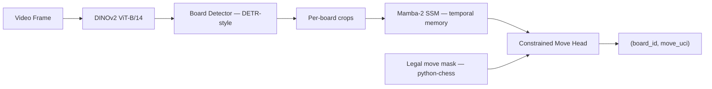
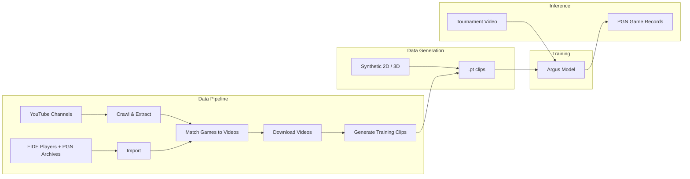
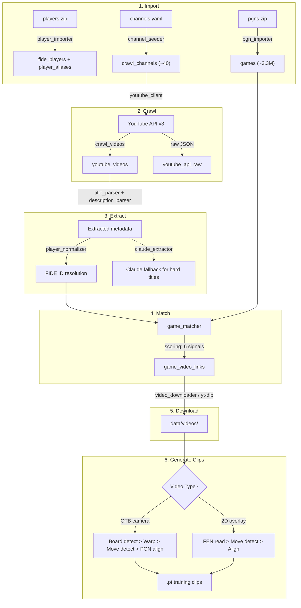
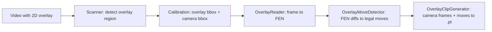
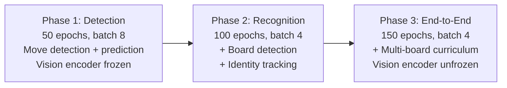
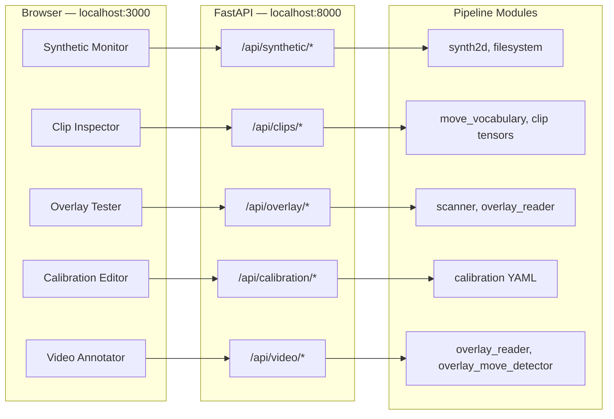
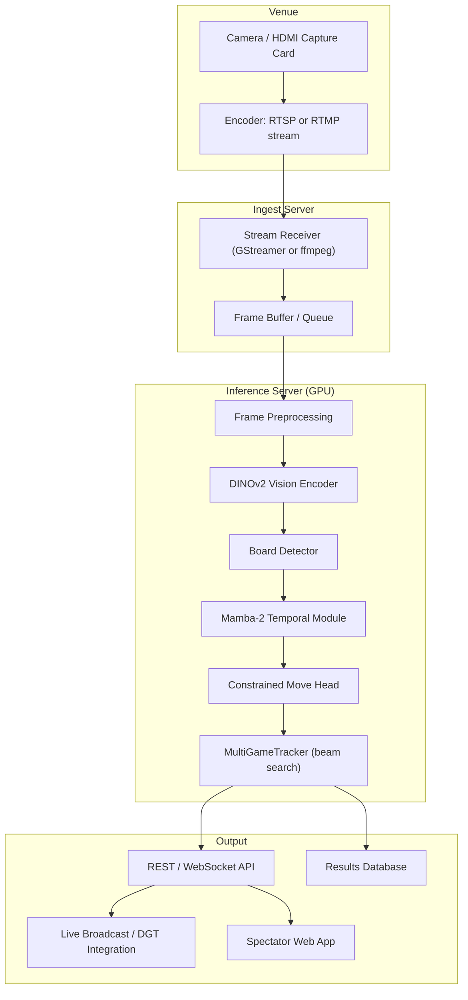
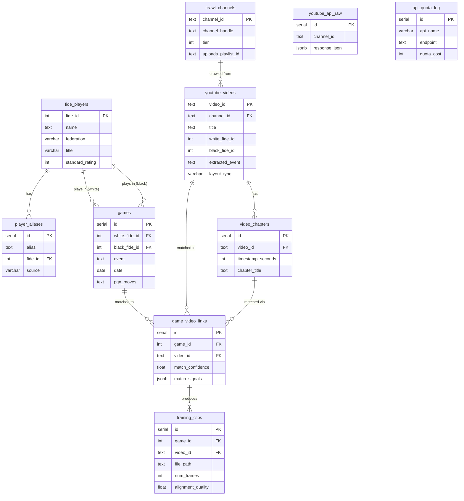

# Argus

Multi-game chess board state tracking from unconstrained video.

Argus reconstructs PGN game records from tournament video by framing move recognition as a VLA-style sequential decision problem. A single model observes video frames and emits `(board_id, move)` events, with chess legality enforced architecturally through constrained decoding — the model literally cannot output an illegal move.

---

**Table of Contents**

- [Architecture](#architecture)
- [Domains](#domains)
- [Quick Start: Training](#quick-start-training)
- [Quick Start: Data Pipeline](#quick-start-data-pipeline)
- [Quick Start: Dev Tools](#quick-start-dev-tools)
- [Data Pipeline](#data-pipeline)
- [Overlay Pipeline](#overlay-pipeline)
- [Data Generation](#data-generation)
- [Training](#training)
- [Inference](#inference)
- [Evaluation](#evaluation)
- [Developer Tools](#developer-tools)
- [Dev Tools REST API](#dev-tools-rest-api)
- [Deployment & Production Status](#deployment--production-status)
- [CLI Reference](#cli-reference)
- [Configuration](#configuration)
- [Database Schema](#database-schema)
- [Project Structure](#project-structure)
- [Key Design Decisions](#key-design-decisions)

---

## Architecture



| Component | Role |
|-----------|------|
| **Vision Encoder** | DINOv2 ViT-B/14 (frozen, then fine-tuned). Dense spatial features for board detection and piece recognition. |
| **Board Detector** | DETR-style transformer decoder with learned board queries. Outputs bounding boxes + identity embeddings, tracked across frames via Hungarian matching. |
| **Temporal Module** | Mamba-2 SSM processes per-board feature sequences in linear time, handling 4+ hour tournaments (14K+ frames). GRU fallback when CUDA unavailable. |
| **Constrained Move Head** | Projects to 1970 logits (1968 UCI moves + NO_MOVE + UNKNOWN). A legal move mask from python-chess zeros out illegal moves before softmax. |

### System Overview



---

## Domains

The codebase is organized into 5 independent domains. Pick the one you're working on — each has its own folder, dependencies, and workflow.

| Domain | Folder | Purpose | Dependencies |
|--------|--------|---------|-------------|
| **Data Pipeline** | `pipeline/` | Curate training data: crawl YouTube, extract metadata, match games, generate clips | PostgreSQL, YouTube API key |
| **Data Generation** | `src/argus/datagen/`, `blender/` | Generate synthetic training clips (2D sprites or 3D Blender) | Cairo (2D), Blender 4.0+ (3D) |
| **Training** | `src/argus/model/`, `src/argus/training/`, `scripts/train.py` | Train the Argus model in 3 phases | PyTorch, GPU, Hydra |
| **Inference** | `src/argus/inference/`, `scripts/infer.py` | Run a trained model on video files to produce PGN | PyTorch, trained checkpoint |
| **Dev Tools** | `dev-tools/` | Web UI for monitoring synthetic data generation and debugging the video overlay pipeline | Docker |

Shared across domains: `src/argus/chess/` (move vocabulary, state machine, constraint masking, PGN writer).

---

## Quick Start: Training

Generate synthetic data and train a model. No database or API keys needed.

> **Tip:** Start [dev tools](#quick-start-dev-tools) first (`make dev-tools`) to monitor synthetic data generation live in the Synthetic tab at http://localhost:3000/synthetic.

```bash
python3 -m venv .venv && source .venv/bin/activate
make dev

# Generate synthetic training data (2D sprites)
# (progress visible live in dev tools → Synthetic tab)
make datagen ARGS="--num-clips 100 --output-dir data/train --image-size 64"
make datagen ARGS="--num-clips 20 --output-dir data/val --image-size 64"

# Train Phase 1 (move detection)
make train ARGS="data.data_dir=data training.wandb.enabled=false"
```

## Quick Start: Data Pipeline

Curate real training data from YouTube + PGN archives. Requires Docker and API keys.

```bash
brew install cairo  # macOS — see CONTRIBUTING.md for other platforms

make db-up
make pipeline-install
cp .env.example .env  # Fill in DATABASE_URL, YOUTUBE_API_KEY, ANTHROPIC_API_KEY

make import-data       # Load FIDE players + PGN games + seed channels
make crawl             # Fetch video metadata from YouTube
make extract           # Parse titles/descriptions for player names, events
make match             # Score game-video pairs
make download-videos   # Fetch matched videos
make generate-clips    # Convert to .pt training clips
```

## Quick Start: Dev Tools

Launch the web-based inspection UI via Docker Compose.

```bash
make dev-tools
# Backend:  http://localhost:8000
# Frontend: http://localhost:3000
```

This starts PostgreSQL, the FastAPI backend, and the Next.js frontend. Stop with `make dev-tools-down`.

---

## Data Pipeline

> **Domain: Pipeline** — `pipeline/`

The pipeline sources real tournament games from PGN archives and matches them to YouTube chess commentary videos, producing annotated training clips with frame-level move alignment.

### Pipeline Flow



### Data Files

Download and place in `data/chess/` before running import:

- **`data/chess/players.zip`** — FIDE player records (JSON). Source: [FIDE ratings](https://ratings.fide.com/download_lists.phtml).
- **`data/chess/pgns.zip`** — PGN game archives (~3.3M games). Source: [TWIC](https://theweekinchess.com/twic).

### Pipeline Stages

| # | Stage | Command | What it does |
|---|-------|---------|-------------|
| 1 | Import | `make import-data` | Load FIDE players (+ aliases), PGN games, YouTube channels into PostgreSQL |
| 2 | Crawl | `make crawl` | Fetch video metadata from ~40 YouTube channels via playlistItems API |
| 3 | Extract | `make extract` | Parse player names, events, rounds from titles/descriptions. Regex first, Claude API fallback for low-confidence titles (`--claude`) |
| 4 | Match | `make match` | Score game-video pairs using 6 weighted signals, store above-threshold matches |
| 5 | Download | `make download-videos` | Fetch matched videos via yt-dlp to `data/videos/{channel}/` |
| 6 | Clips | `make generate-clips` | Convert videos into `.pt` training clips with frame-level move alignment |

### How Matching Works

Videos are matched to games using six weighted signals:

| Signal | Weight | Method |
|--------|--------|--------|
| Player match | 35% | FIDE ID comparison (exact via TWIC headers, fuzzy via pg_trgm aliases) |
| Event similarity | 20% | pg_trgm trigram similarity on event names |
| Date proximity | 15% | Published date vs game date (same day = 1.0, decays over 30 days) |
| PGN verification | 15% | First 15 moves compared in UCI notation |
| Round match | 10% | Normalized round number comparison |
| Result match | 5% | Game result agreement (1-0, 0-1, 1/2-1/2) |

**Testing matching independently:** You can test each scoring signal in isolation:

```bash
pytest tests/pipeline/test_scoring.py -v        # All 6 scoring signals
pytest tests/pipeline/test_pgn_verifier.py -v   # PGN move comparison
pytest tests/pipeline/test_pgn_aligner.py -v    # Move alignment
```

There is currently no single-video match command — `make match` processes all unmatched videos against the game database. To test matching on specific videos, call `match_video_to_games()` from `pipeline/match/game_matcher.py` directly in a script.

### How OTB Clip Generation Works

For over-the-board camera videos:

1. **Board detection** — OpenCV contour/Hough line detection locates the chess board
2. **Perspective warp** — Board region warped to canonical 512x512 view
3. **Move detection** — Frame differencing finds motion peaks at piece moves
4. **PGN alignment** — Detected moves aligned to the known PGN move sequence
5. **Clip output** — `.pt` file with `frames` (T, 3, 224, 224), `move_targets`, `detect_targets`, `legal_masks`, `move_mask`

---

## Overlay Pipeline

> **Domain: Pipeline** — `pipeline/overlay/` (Stage 6 alternative path)

A parallel clip generation path for videos that include a rendered 2D board overlay (lichess, chess.com streams). Instead of OpenCV board detection on camera footage, it reads the board state directly from the overlay pixels.

### Overlay Flow



### Components

| Module | What it does |
|--------|-------------|
| `scanner.py` | Detects rendered 2D boards via pixel regularity (low intra-square variance, alternating light/dark). Sliding window at multiple scales. |
| `overlay_reader.py` | Template-matches each of the 64 squares against piece libraries per theme. Returns FEN. Supports `lichess_default`, `chess_com_green`, `chess_com_brown`. |
| `overlay_move_detector.py` | Compares FENs across frames with a stability window. Uses python-chess to find the legal move transforming old FEN to new FEN. Detects game resets. |
| `calibration.py` | Stores per-channel layout configs: overlay crop, camera crop, reference resolution, board flip, board theme. Persisted in `configs/pipeline/overlay_layouts.yaml`. |
| `overlay_clip_generator.py` | Combines camera crops with overlay-detected moves to produce `.pt` files in the same format as OTB clips. |
| `diagnostics.py` | `test_image()`, `test_reader()`, `inspect_clip()` — inspection and debugging tools. |

### Overlay CLI

```bash
# Screen crawled videos for overlay presence
python -m pipeline.cli overlay-scan --channel @STLChessClub --limit 50

# Set calibration for a channel
python -m pipeline.cli overlay-calibrate \
  --channel @STLChessClub \
  --overlay 1280,50,600,600 \
  --camera 50,100,800,600 \
  --resolution 1920x1080 \
  --theme lichess_default

# Generate clips from an overlay video
python -m pipeline.cli overlay-generate --video path/to/video.mp4 --channel @STLChessClub

# Test detection + reading on a screenshot
python -m pipeline.cli overlay-test --image screenshot.png --output annotated.png
```

---

## Data Generation

> **Domain: Data Generation** — `src/argus/datagen/`, `blender/`

Synthetic training data generation. This is separate from the real data pipeline — it doesn't need a database or API keys, just Cairo (for 2D) or Blender (for 3D).

Uses plain argparse (not Hydra). Entry point: `scripts/generate_data.py`.

```bash
# 2D sprite-based data (fast, Phase 1)
make datagen ARGS="--num-clips 5000 --output-dir data/train"
make datagen ARGS="--num-clips 500 --output-dir data/val"

# Smaller for local development
make datagen ARGS="--num-clips 100 --output-dir data/dev --image-size 64"

# 3D Blender-rendered data (Phase 2+, requires Blender 4.0+)
make datagen ARGS="--type 3d --num-clips 200 --output-dir data/3d"
```

**2D generation** (`synth2d.py`): Renders chess positions via `chess.svg` + CairoSVG. Creates temporal clips with ground-truth annotations. Fast enough for rapid iteration.

**3D generation** (`scene_builder.py`, `camera.py`, `lighting.py`, `humans.py`): Blender-based scene composition with camera motion, lighting variation, and occlusion simulation. Higher fidelity, much slower.

Both output `.pt` files in the same format as the real pipeline clips.

---

## Training

> **Domain: Training** — `src/argus/model/`, `src/argus/training/`, `scripts/train.py`

### What is Hydra?

[Hydra](https://hydra.cc/) is a composable YAML configuration framework. It lets you override any training parameter from the command line without editing YAML files. **Hydra is only used for training** (`scripts/train.py`). Inference, evaluation, and data generation all use plain argparse.

### Training Phases



| Phase | Config | Focus | Loss Weights |
|-------|--------|-------|-------------|
| 1 — Detection | `training=phase1_detection` | Move detection + basic move prediction | move=1.0, detect=0.5 |
| 2 — Recognition | `training=phase2_recognition` | Add board detection + identity tracking | move=1.0, detect=0.5, bbox=1.0, identity=0.5 |
| 3 — End-to-End | `training=phase3_endtoend` | Full multi-board with curriculum (4 to 10 to 20 boards, increasing occlusion) | move=1.0, detect=0.5, bbox=1.0, identity=0.5 |

### Running Training

```bash
# From pre-generated data on disk (recommended)
make train ARGS="data.data_dir=data training.wandb.enabled=false"

# Or generate on-the-fly (slower)
make train ARGS="data.num_train_clips=100 data.num_val_clips=20 data.image_size=64 training.wandb.enabled=false"

# Phase-specific configs
make train ARGS="training=phase1_detection data.data_dir=data"
make train ARGS="training=phase2_recognition data.data_dir=data"
make train ARGS="training=phase3_endtoend data.data_dir=data"

# Override any parameter
make train ARGS="training=phase1_detection training.batch_size=16 training.optimizer.lr=5e-4"
```

Checkpoints are saved to `outputs/{date}/{time}/checkpoint_epoch{N}.pt` containing model weights, optimizer state, and scheduler state.

---

## Inference

> **Domain: Inference** — `src/argus/inference/`, `scripts/infer.py`

Inference processes a pre-recorded video file and outputs PGN game records. Uses plain argparse (not Hydra).

```bash
make infer ARGS="--video tournament.mp4 --checkpoint outputs/checkpoint_epoch0050.pt --output-dir pgns/"
```

| Flag | Default | Description |
|------|---------|-------------|
| `--video` | required | Input video file |
| `--checkpoint` | required | Model checkpoint `.pt` path |
| `--output-dir` | required | Directory to save PGN files |
| `--fps` | 1.0 | Frames per second to process |
| `--detect-threshold` | 0.5 | Move detection threshold |
| `--confidence-threshold` | 0.3 | Move prediction confidence threshold |

### How It Works

```mermaid
graph LR
    V[Video file] --> DEC[PyAV frame decoder]
    DEC -->|fps sampling| ENC[Vision Encoder]
    ENC --> DET[Board Detector]
    DET --> TMP[Temporal Module]
    TMP --> MH[Move Head + Legal Mask]
    MH --> TRACK[MultiGameTracker]
    TRACK --> POST[Post-processing]
    POST --> PGN["PGN files (one per board)"]
```



**MultiGameTracker** manages concurrent chess games with full state validation. It supports beam search for error recovery and generates one PGN file per detected board.

**Post-processing** applies confidence gating, detects game completion (checkmate, stalemate, long no-move gaps), and validates/repairs PGN output.

### Current Limitations

- **Single-board mode only** — multi-board detection + tracking has a TODO in `inference/pipeline.py`. Single-board crop mode is fully working.
- **File-based only** — expects a seekable video file via PyAV. No streaming, RTSP, or live camera input.
- **No model export** — PyTorch checkpoint only. No ONNX, TorchScript, or TensorRT.

See [Deployment & Production Status](#deployment--production-status) for the full gap analysis.

---

## Evaluation

> **Domain: Training** — `src/argus/eval/`, `scripts/evaluate.py`

```bash
make eval ARGS="--checkpoint outputs/checkpoint_epoch0050.pt --num-clips 200"
```

Uses plain argparse (not Hydra).

| Metric | Abbreviation | Description |
|--------|-------------|-------------|
| Move Accuracy | MA | Correct moves / total moves |
| Move Detection F1 | MDF1 | Precision/recall on "did a move happen?" |
| PGN Edit Distance | PED | Levenshtein distance between predicted and ground-truth move lists |
| Prefix Accuracy | PA | Longest correct PGN prefix / game length |
| Board Detection mAP | mAP | Standard mAP@0.5 for board localization |
| Identity Switch Rate | ISR | ID switches per 1000 frames |
| Occlusion Recovery Rate | ORR | Correct re-ID after N frames of occlusion |

---

## Developer Tools

> **Domain: Dev Tools** — `dev-tools/`

A web-based inspection suite for monitoring synthetic data generation and debugging the video overlay pipeline. Built with Next.js 14 (frontend) + FastAPI (backend).

Tools are grouped into two areas:

- **Synthetic** — monitor data generation progress, inspect training clips
- **Video** — debug overlay detection, calibrate crop regions, annotate video

### How Dev Tools Relate to the Pipeline

The dev-tools services are thin REST wrappers — they directly import from `pipeline.overlay.*`, `argus.datagen`, and `argus.chess`. Every web tool has a CLI equivalent.

| Dev Tool | Area | Modules Wrapped | CLI Equivalent |
|----------|------|-----------------|----------------|
| **Synthetic Monitor** | Synthetic | `argus.datagen.synth2d`, filesystem scanner | `datagen` |
| **Clip Inspector** | Synthetic | `argus.chess.move_vocabulary`, PyTorch tensors | `inspect-clip` |
| **Overlay Tester** | Video | `pipeline.overlay.scanner`, `overlay_reader` | `overlay-test` |
| **Calibration Editor** | Video | `pipeline.overlay.calibration` | `overlay-calibrate` |
| **Video Annotator** | Video | `pipeline.overlay.overlay_reader`, `overlay_move_detector` | `overlay-test`, `overlay-generate` |

### Dev Tools Architecture



### Starting Dev Tools

```bash
make dev-tools       # Starts PostgreSQL + FastAPI + Next.js via docker-compose
make dev-tools-down  # Stop everything
```

This uses docker-compose profiles. The dev-tools services only start with `make dev-tools`, not with `make db-up`.

**Manual startup** (without Docker, for dev-tools development):

```bash
# Terminal 1: FastAPI backend
cd dev-tools/api && python -m uvicorn main:app --reload --port 8000

# Terminal 2: Next.js frontend
cd dev-tools && npm install && npm run dev
```

### Tools

| Tool | URL | Purpose |
|------|-----|---------|
| **Synthetic Monitor** | `/synthetic` | Watch synthetic data generation live, browse clips, inspect frames and tensors, view aggregated stats |
| **Clip Inspector** | `/clip-inspector` | Upload a `.pt` training clip, view frames, inspect tensor metadata, validate move sequence against chess rules |
| **Overlay Tester** | `/overlay-tester` | Upload a screenshot, auto-detect or manually draw the overlay bounding box, get FEN + annotated image |
| **Calibration Editor** | `/calibration` | Draw overlay and camera crop regions on a sample frame, save per-channel calibration to YAML |
| **Video Annotator** | `/video-annotator` | Step through a video frame-by-frame, read overlay FEN at any frame, run full move detection |

### CLI Inspection Tools

```bash
python -m pipeline.cli inspect-clip --file clip_0001.pt --save-frames --output-dir frames/
python -m pipeline.cli overlay-test --image screenshot.png --output annotated.png
python -m pipeline.cli overlay-test-reader --image screenshot.png --overlay 100,50,600,600
python -m pipeline.cli stats  # Pipeline statistics (row counts per table)
```

---

## Dev Tools REST API

The FastAPI backend at `localhost:8000` exposes these endpoints. The Next.js frontend proxies `/api/*` requests to this server.

### Synthetic Monitor

| Method | Path | Description |
|--------|------|-------------|
| `GET` | `/api/synthetic/scan?directory=...&expected_clips=...` | Scan directory for `.pt` files (lightweight, for polling) |
| `GET` | `/api/synthetic/stats?directory=...` | Compute aggregated stats across all clips (loads all `.pt` files) |
| `POST` | `/api/synthetic/inspect` | Load a clip from disk into a clip inspection session |

### Overlay Tester

| Method | Path | Description |
|--------|------|-------------|
| `POST` | `/api/overlay/test-image` | Test overlay detection + FEN reading on an uploaded image |

**Request** (multipart form):

| Field | Type | Required | Description |
|-------|------|----------|-------------|
| `image` | File | yes | Screenshot image |
| `overlay_bbox` | string | no | Manual bbox `"x,y,w,h"` (skip auto-detect) |
| `flipped` | bool | no | Board flipped (Black at bottom). Default: `false` |
| `theme` | string | no | Board theme. Default: `"lichess_default"` |

**Response**: JSON with detected FEN, piece count, annotated image (base64), detection confidence.

### Clip Inspector

| Method | Path | Description |
|--------|------|-------------|
| `POST` | `/api/clips/load` | Upload `.pt` clip, create inspection session |
| `GET` | `/api/clips/{session_id}/info` | Full clip metadata (shapes, dtypes, moves, validation) |
| `GET` | `/api/clips/{session_id}/frame/{index}` | Single frame as PNG |
| `DELETE` | `/api/clips/{session_id}` | Clean up session |

**`POST /api/clips/load`** (multipart form): `clip_file` (File, required)

**Response**: `{ "session_id": "abc123" }`

**`GET /api/clips/{session_id}/info`**: Returns JSON with tensor shapes, frame count, pixel ranges, move list with frame indices, validation result (replayed against chess rules), final FEN.

### Calibration

| Method | Path | Description |
|--------|------|-------------|
| `GET` | `/api/calibration/` | List all saved calibrations |
| `GET` | `/api/calibration/{channel_handle}` | Get calibration for a channel |
| `PUT` | `/api/calibration/{channel_handle}` | Create or update calibration |
| `DELETE` | `/api/calibration/{channel_handle}` | Delete calibration |

**`PUT` request body**:
```json
{
  "overlay": [1280, 50, 600, 600],
  "camera": [50, 100, 800, 600],
  "ref_resolution": [1920, 1080],
  "board_flipped": false,
  "board_theme": "lichess_default"
}
```

### Video Annotator

| Method | Path | Description |
|--------|------|-------------|
| `POST` | `/api/video/open` | Open a video file, create annotation session |
| `GET` | `/api/video/{session_id}/frame?index=N` | Get frame as JPEG |
| `GET` | `/api/video/{session_id}/overlay-read?index=N` | Read overlay FEN + crops at frame |
| `POST` | `/api/video/{session_id}/detect-moves` | Run full move detection |
| `DELETE` | `/api/video/{session_id}` | Close session |

**`POST /api/video/open`**: `{ "video_path": "/path/to/video.mp4", "channel_handle": "@STLChessClub" }`

**`POST /api/video/{session_id}/detect-moves`**: `{ "sample_fps": 2.0 }`

**Response**: JSON with game segments, each containing moves (UCI + SAN), frame indices, timestamps, FEN before/after.

### Health Check

| Method | Path | Description |
|--------|------|-------------|
| `GET` | `/api/health` | Returns `{"status": "ok"}` |

---

## Deployment & Production Status

### What Exists Today

| Component | Status | How to Run |
|-----------|--------|-----------|
| **Batch inference** | Working (single-board) | `make infer ARGS="--video file.mp4 --checkpoint model.pt --output-dir pgns/"` |
| **Model format** | PyTorch `.pt` checkpoints | Saved by trainer, loaded by inference pipeline |
| **Database** | Dev-only PostgreSQL via docker-compose | `make db-up` — no production DB exists |
| **Pipeline** | Runs locally on developer machines | `make crawl`, `make match`, etc. |
| **Dev Tools** | Local Docker Compose | `make dev-tools` |

The pipeline and database are **developer-local only**. There is no production deployment, no hosted database, and no CI/CD pipeline for any component.

### Target Production Architecture



### Gap Analysis

| Gap | What's Needed | Current State |
|-----|--------------|---------------|
| **Streaming input** | RTSP/RTMP/HLS reader via GStreamer or ffmpeg subprocess, frame queue with backpressure | PyAV on seekable files only |
| **Multi-board inference** | Complete the TODO in `src/argus/inference/pipeline.py` | Single-board crop mode works; multi-board detection + tracking skeleton exists but is incomplete |
| **Model export** | ONNX export script, optional TensorRT conversion for lower latency | PyTorch checkpoint only — no cross-platform format |
| **Inference server** | FastAPI or gRPC serving endpoint with request queuing and health checks | No model-serving endpoint — dev-tools API is for debugging, not production |
| **Containerization** | Dockerfile for inference server, Kubernetes manifests, GPU resource requests | No Dockerfile for model serving (only for dev-tools) |
| **Monitoring** | Prometheus metrics (fps, latency, move confidence), structured JSON logging, alerting | Basic Python `logging` module only |
| **Results storage** | Production database schema for inferred games, move events, confidence scores | Current schema is for pipeline data curation only |
| **Error recovery** | Graceful handling of stream drops, partial result persistence, auto-reconnect | Video I/O errors crash the process |

### Equipment for Live Tournament Setup

| Component | Recommended | Purpose |
|-----------|-------------|---------|
| Video capture | HDMI capture card (Elgato, Magewell) or IP camera with RTSP | Get video from tournament cameras |
| GPU server | NVIDIA RTX 3090+ or A100 | Real-time Mamba-2 inference (CUDA required; GRU fallback for CPU but untested at scale) |
| Network | Wired Ethernet | Reliable streaming from capture to inference |
| Software | Streaming server + Argus inference server | **Not yet built** — see gaps above |

---

## CLI Reference

All pipeline commands: `python -m pipeline.cli <command> [options]`. Add `-v` for verbose logging.

### Pipeline Domain

| Command | Makefile | Description | Key Options |
|---------|----------|-------------|-------------|
| `db-init` | `make db-up` (includes schema) | Apply database schema | |
| `import-players` | `make import-data` | Load `data/chess/players.zip` | |
| `import-pgns` | `make import-data` | Load `data/chess/pgns.zip` | `--limit N` |
| `seed-channels` | `make import-data` | Load `configs/pipeline/channels.yaml` | |
| `resolve-channels` | — | Resolve @handles to YouTube channel IDs | |
| `crawl` | `make crawl` | Crawl YouTube channels | `--channel @Handle`, `--refresh` |
| `extract` | `make extract` | Extract metadata from titles | `--claude` (enable Claude API fallback) |
| `match` | `make match` | Match games to videos | `--min-confidence 60.0` |
| `download` | `make download-videos` | Download matched videos | `--min-confidence 70.0`, `--limit N` |
| `generate-clips` | `make generate-clips` | Generate OTB training clips | `--min-confidence 70.0`, `--limit N` |

### Pipeline Domain — Overlay

| Command | Description | Key Options |
|---------|-------------|-------------|
| `overlay-scan` | Screen videos for 2D overlay presence | `--channel @Handle`, `--limit N` |
| `overlay-calibrate` | Set layout calibration for a channel | `--channel` (required), `--overlay x,y,w,h`, `--camera x,y,w,h`, `--resolution WxH`, `--flipped`, `--theme` |
| `overlay-generate` | Generate clips from overlay videos | `--video PATH` (required), `--channel` (required) |
| `overlay-test` | Test overlay detection on a screenshot | `--image PATH` (required), `--overlay x,y,w,h`, `--flipped`, `--theme`, `--output PATH` |
| `overlay-test-reader` | Test reader on a specific region | `--image PATH`, `--overlay x,y,w,h` (both required), `--flipped`, `--theme` |

### Pipeline Domain — Inspection

| Command | Description | Key Options |
|---------|-------------|-------------|
| `inspect-clip` | Inspect a `.pt` training clip | `--file PATH` (required), `--save-frames`, `--output-dir DIR` |
| `stats` | Print pipeline statistics (row counts per table) | |

### Training / Inference / Data Generation (via Makefile)

| Target | Domain | Description | Example |
|--------|--------|-------------|---------|
| `make datagen` | Data Generation | Generate synthetic training data | `ARGS="--num-clips 5000 --output-dir data/train"` |
| `make train` | Training | Train model (Hydra config) | `ARGS="training=phase1_detection data.data_dir=data"` |
| `make eval` | Training | Evaluate model | `ARGS="--checkpoint outputs/ckpt.pt --num-clips 200"` |
| `make infer` | Inference | Run inference on video | `ARGS="--video file.mp4 --checkpoint ckpt.pt --output-dir pgns/"` |

---

## Configuration

### Hydra (Training Only)

[Hydra](https://hydra.cc/) is a composable YAML config framework. It is **only used for training** (`scripts/train.py`). All other entry points (inference, evaluation, data generation, pipeline CLI) use plain argparse.

Hydra lets you compose config groups and override any parameter from the command line:

```bash
make train ARGS="training=phase1_detection training.batch_size=16 model.temporal.d_model=256"
```

```
configs/
├── config.yaml                    # Root config (composes all groups below)
├── model/
│   ├── argus_base.yaml            # 768-dim vision, 512-dim temporal, 1970 vocab
│   └── argus_small.yaml           # Smaller variant for development
├── data/
│   ├── synthetic.yaml             # On-the-fly generation settings
│   └── real.yaml                  # Disk-loaded real data settings
├── training/
│   ├── phase1_detection.yaml      # 50 epochs, move + detect losses
│   ├── phase2_recognition.yaml    # 100 epochs, + bbox + identity losses
│   └── phase3_endtoend.yaml       # 150 epochs, curriculum, unfreeze vision
├── eval/
│   └── default.yaml               # Evaluation defaults
└── datagen/
    ├── scene_simple.yaml          # Simple 2D scene configs
    └── scene_tournament.yaml      # Tournament-style scene configs
```

### Pipeline Configuration (Plain YAML)

Pipeline configs are plain YAML files, not Hydra:

```
configs/pipeline/
├── channels.yaml              # ~40 YouTube channels across 5 tiers
└── overlay_layouts.yaml       # Per-channel overlay/camera calibrations
```

### Environment Variables

Copy `.env.example` to `.env` and fill in:

| Variable | Required For | Description |
|----------|-------------|-------------|
| `DATABASE_URL` | Pipeline | PostgreSQL connection string |
| `YOUTUBE_API_KEY` | Crawl | YouTube Data API v3 key |
| `ANTHROPIC_API_KEY` | Extract (optional) | Claude API for hard-to-parse titles |

### Channel Tiers

The pipeline crawls YouTube channels organized into 5 tiers in `configs/pipeline/channels.yaml`:

| Tier | Type | Examples |
|------|------|---------|
| 1 | Per-game coverage (structured titles) | agadmator, GothamChess |
| 2 | Official tournaments (multi-board, use chapters) | Chess.com, STLCC |
| 3 | Regional / language-segmented | ChessBase India |
| 4 | FIDE & national federations | FIDE channel |
| 5 | Individual GM channels (supplemental) | GM streams |

---

## Database Schema

> **Domain: Pipeline** — used only by the data pipeline, not by training or inference.

PostgreSQL 16 with `pg_trgm` extension for fuzzy text matching. Start with `make db-up`.



### Key Indexes

- `pg_trgm` GIN indexes on `fide_players.name`, `player_aliases.alias`, `games.event`, `youtube_videos.extracted_event` — powers fuzzy matching
- Composite index on `games(white_fide_id, black_fide_id, date)` — fast candidate queries during matching
- `game_video_links(match_confidence DESC)` — efficient threshold filtering

---

## Project Structure

```
argus/
├── configs/                                    # Configuration
│   ├── config.yaml                             # Hydra root (Training only)
│   ├── model/                                  # Training: model architecture configs
│   ├── data/                                   # Training: data loading configs
│   ├── training/                               # Training: phase1, phase2, phase3
│   ├── eval/                                   # Training: evaluation defaults
│   ├── datagen/                                # Data Gen: scene configs
│   └── pipeline/                               # Pipeline: channels + overlay calibrations
├── src/argus/                                  # ML code
│   ├── types.py                                # Shared: core dataclasses
│   ├── chess/                                  # Shared: chess logic layer
│   │   ├── move_vocabulary.py                  #   1968 UCI moves + special tokens
│   │   ├── state_machine.py                    #   python-chess wrapper, legal mask gen
│   │   ├── constraint_mask.py                  #   Legal move masking for model output
│   │   └── pgn_writer.py                       #   Move events to PGN
│   ├── model/                                  # Training: neural network components
│   │   ├── argus_model.py                      #   Full model assembly
│   │   ├── vision_encoder.py                   #   DINOv2 ViT-B/14
│   │   ├── board_detector.py                   #   DETR-style detection
│   │   ├── board_id_head.py                    #   Board identity tracking
│   │   ├── temporal.py                         #   Mamba-2 SSM (GRU fallback)
│   │   ├── move_head.py                        #   Constrained move prediction
│   │   └── losses.py                           #   Focal + CE + GIoU + contrastive
│   ├── data/                                   # Training: data loading
│   │   ├── dataset.py                          #   ArgusDataset (disk) + InMemory
│   │   ├── transforms.py                       #   Augmentations
│   │   ├── collate.py                          #   Variable-length batching
│   │   └── pgn_sampler.py                      #   Game sampling from PGN files
│   ├── datagen/                                # Data Gen: synthetic data generation
│   │   ├── synth2d.py                          #   2D sprite compositing
│   │   ├── scene_builder.py                    #   Blender scene composition
│   │   ├── camera.py                           #   Camera placement/motion
│   │   ├── lighting.py                         #   Lighting variation
│   │   ├── humans.py                           #   Occlusion simulation
│   │   ├── game_driver.py                      #   PGN to 3D piece positions
│   │   └── renderer.py                         #   Render loop + annotations
│   ├── training/                               # Training: training loop
│   │   ├── trainer.py                          #   AdamW, bf16, grad accum, W&B
│   │   └── scheduler.py                        #   Curriculum learning
│   ├── eval/                                   # Training: evaluation
│   │   ├── metrics.py                          #   MA, MDF1, PED, PA, ISR, ORR
│   │   ├── evaluator.py                        #   End-to-end eval pipeline
│   │   └── visualizer.py                       #   Prediction overlay on video
│   └── inference/                              # Inference: runtime
│       ├── pipeline.py                         #   Video to PGN
│       ├── tracker.py                          #   Multi-game tracker + beam search
│       └── postprocess.py                      #   Confidence gating, game completion
├── pipeline/                                   # Pipeline: data curation
│   ├── cli.py                                  #   Unified CLI entry point
│   ├── db/                                     #   Database
│   │   ├── schema.sql                          #     Full DDL (11 tables, pg_trgm)
│   │   └── connection.py                       #     psycopg3 pool from DATABASE_URL
│   ├── importers/                              #   Stage 1: data import
│   │   ├── player_importer.py                  #     players.zip to fide_players + aliases
│   │   ├── pgn_importer.py                     #     pgns.zip to games (~3.3M rows)
│   │   └── channel_seeder.py                   #     channels.yaml to crawl_channels
│   ├── crawl/                                  #   Stage 2: YouTube crawling
│   │   ├── youtube_client.py                   #     API v3 wrapper + backoff
│   │   ├── quota_tracker.py                    #     Halt at 500 units remaining
│   │   ├── channel_resolver.py                 #     @Handle to channel_id
│   │   └── crawl_videos.py                     #     Paginate + store raw + parsed
│   ├── extract/                                #   Stage 3: metadata extraction
│   │   ├── title_parser.py                     #     Regex: "X vs Y | Event Round N"
│   │   ├── description_parser.py               #     Chapters + PGN extraction
│   │   ├── player_normalizer.py                #     pg_trgm fuzzy to FIDE IDs
│   │   ├── claude_extractor.py                 #     Claude API fallback
│   │   └── extract_metadata.py                 #     Orchestrator
│   ├── match/                                  #   Stage 4: game-video matching
│   │   ├── scoring.py                          #     6-signal weighted confidence
│   │   ├── pgn_verifier.py                     #     First 15+ move comparison
│   │   ├── game_matcher.py                     #     Query candidates, score, rank
│   │   └── match_pipeline.py                   #     Orchestrator
│   ├── download/                               #   Stage 5: video download
│   │   └── video_downloader.py                 #     yt-dlp with rate limiting
│   ├── clips/                                  #   Stage 6: OTB clip generation
│   │   ├── board_detector.py                   #     OpenCV board detection + warp
│   │   ├── move_detector.py                    #     Frame differencing + peaks
│   │   ├── pgn_aligner.py                      #     Align moves to PGN
│   │   └── clip_generator.py                   #     Video + PGN to .pt clips
│   └── overlay/                                #   Stage 6: overlay clip generation
│       ├── scanner.py                          #     Detect 2D board overlays
│       ├── overlay_reader.py                   #     Template match to FEN
│       ├── overlay_move_detector.py            #     FEN diffs to legal moves
│       ├── overlay_clip_generator.py           #     Camera frames + moves to .pt
│       ├── calibration.py                      #     Per-channel layout config
│       └── diagnostics.py                      #     test_image, test_reader, inspect_clip
├── dev-tools/                                  # Dev Tools: inspection web UI
│   ├── Dockerfile.api                          #   FastAPI container
│   ├── Dockerfile.ui                           #   Next.js container
│   ├── api/                                    #   FastAPI backend (localhost:8000)
│   │   ├── main.py                             #     App + CORS + router registration
│   │   ├── routers/                            #     overlay, calibration, clips, video
│   │   └── services/                           #     Thin wrappers over pipeline modules
│   ├── app/                                    #   Next.js 14 pages (localhost:3000)
│   │   ├── overlay-tester/
│   │   ├── clip-inspector/
│   │   ├── calibration/
│   │   └── video-annotator/
│   ├── components/                             #   Reusable React components
│   │   ├── BboxDrawer.tsx                      #     Interactive bounding box canvas
│   │   ├── ChessBoard.tsx                      #     FEN to SVG board renderer
│   │   ├── MoveList.tsx                        #     Move list with frame badges
│   │   └── FileUpload.tsx                      #     Drag-and-drop file upload
│   ├── next.config.js                          #   API proxy (env-configurable)
│   └── package.json                            #   Next.js 14, React 18, Radix UI
├── scripts/                                    # Entry points
│   ├── train.py                                #   Training (Hydra)
│   ├── evaluate.py                             #   Evaluation (argparse)
│   ├── infer.py                                #   Inference (argparse)
│   └── generate_data.py                        #   Data generation (argparse)
├── tests/                                      # pytest suite
│   ├── test_move_vocabulary.py                 #   Shared: chess core
│   ├── test_chess_state_machine.py             #   Shared: chess core
│   ├── test_constraint_mask.py                 #   Shared: chess core
│   └── pipeline/                               #   Pipeline domain
│       ├── test_title_parser.py                #     Stage 3: extraction
│       ├── test_description_parser.py          #     Stage 3: extraction
│       ├── test_player_aliases.py              #     Stage 3: extraction
│       ├── test_scoring.py                     #     Stage 4: matching
│       ├── test_pgn_verifier.py                #     Stage 4: matching
│       ├── test_pgn_aligner.py                 #     Stage 6: clip generation
│       ├── test_overlay_reader.py              #     Stage 6: overlay
│       └── test_overlay_move_detector.py       #     Stage 6: overlay
├── blender/                                    # Data Gen: 3D assets
├── docker-compose.yaml                         # PostgreSQL + dev-tools (profiles)
├── Makefile                                    # All build/run targets
├── pyproject.toml                              # ML package dependencies
├── .env.example                                # API key template
└── CONTRIBUTING.md                             # Contributor guide
```

---

## Key Design Decisions

**Constrained decoding over post-hoc filtering.** The legal move mask is applied before softmax, not after. The model's probability distribution is defined only over legal moves, so training signal is never wasted on impossible outputs.

**Move vocabulary as fixed enumeration.** All 1968 reachable UCI moves (queen/rook/bishop lines + knight L-shapes + pawn promotions) are assigned deterministic indices. This mapping never changes — model weights, loss functions, and metrics all depend on it.

**Mamba-2 over transformers for temporal modeling.** Linear-time complexity in sequence length handles full tournaments (14K+ frames) without quadratic attention costs. The SSM hidden state acts as compressed game memory.

**Synthetic data first.** 2D sprite compositing enables rapid iteration on model architecture before investing in expensive Blender renders. The curriculum progressively increases difficulty (resolution, occlusion, board count).

**Dual clip generation paths.** OTB videos use OpenCV board detection + frame differencing. Overlay videos use pixel-level FEN reading + FEN comparison. Both produce identical `.pt` output format, so the training pipeline doesn't distinguish between them.

**Crawl-then-match over per-game search.** The pipeline crawls ~40 YouTube channels once (~940 API quota units) and builds a local index, then matches all ~3.3M games against it locally. This avoids the prohibitive cost of one YouTube search per game (100 units each).

**Pipeline separated from ML code.** `pipeline/` has disjoint dependencies (psycopg, google-api-python-client, yt-dlp) from `src/argus/` (torch, transformers). The pipeline imports `argus.chess` only where needed (PGN verification).

**Dev tools as thin REST wrappers.** The `dev-tools/` services directly import from `pipeline.overlay.*` — no logic duplication. Every web tool has a CLI equivalent. This keeps the pipeline CLI as the source of truth while providing visual debugging.
