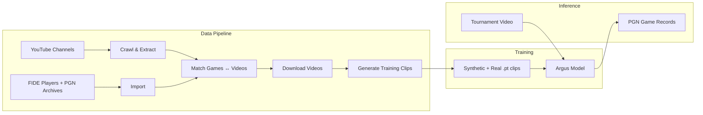
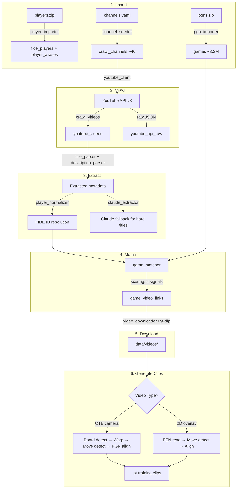
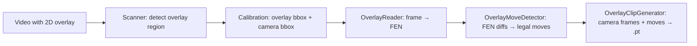
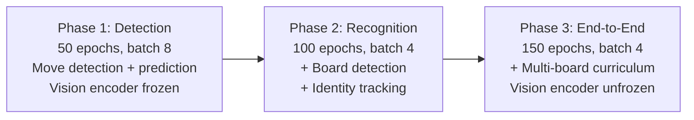
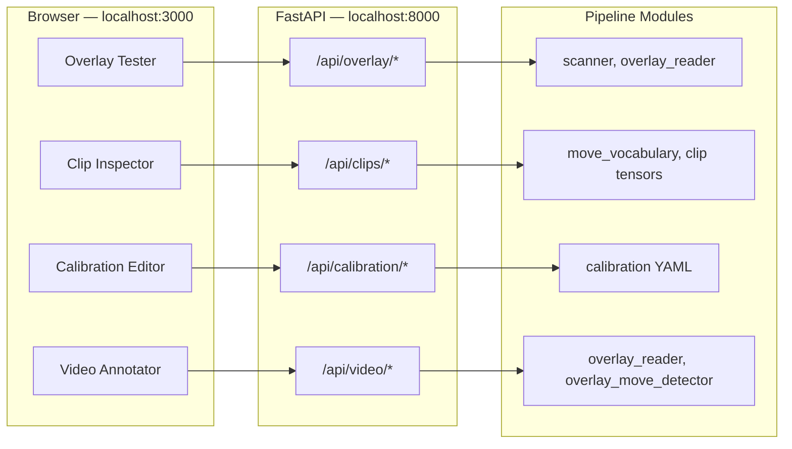
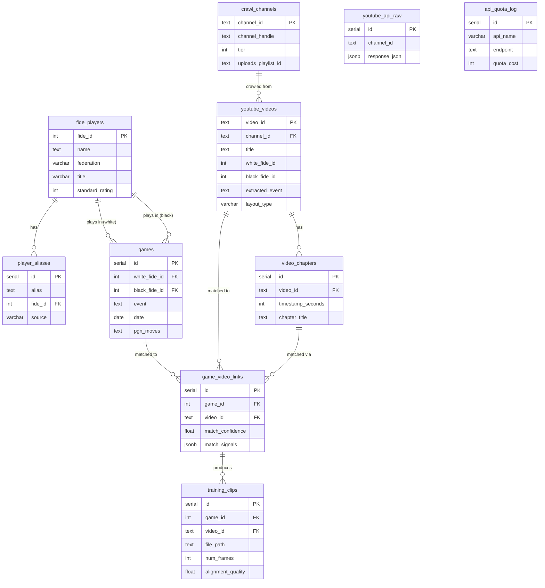

# Argus

Multi-game chess board state tracking from unconstrained video.

Argus reconstructs PGN game records from tournament video by framing move recognition as a VLA-style sequential decision problem. A single model observes video frames and emits `(board_id, move)` events, with chess legality enforced architecturally through constrained decoding — the model literally cannot output an illegal move.

---

**Table of Contents**

- [Architecture](#architecture)
- [Quick Start](#quick-start)
- [Data Pipeline](#data-pipeline)
- [Overlay Pipeline](#overlay-pipeline)
- [Training](#training)
- [Inference](#inference)
- [Evaluation](#evaluation)
- [Developer Tools](#developer-tools)
- [Dev Tools REST API](#dev-tools-rest-api)
- [CLI Reference](#cli-reference)
- [Configuration](#configuration)
- [Database Schema](#database-schema)
- [Project Structure](#project-structure)
- [Key Design Decisions](#key-design-decisions)

---

## Architecture

```
Video Frame → DINOv2 ViT-B/14 → Board Detector (DETR-style) → Per-board crops
                                                                    ↓
Per-board features → Mamba-2 SSM (temporal memory) → Constrained Move Head → (board_id, move_uci)
                                                           ↑
                                                 Legal move mask (python-chess)
```

| Component | Role |
|-----------|------|
| **Vision Encoder** | DINOv2 ViT-B/14 (frozen, then fine-tuned). Dense spatial features for board detection and piece recognition. |
| **Board Detector** | DETR-style transformer decoder with learned board queries. Outputs bounding boxes + identity embeddings, tracked across frames via Hungarian matching. |
| **Temporal Module** | Mamba-2 SSM processes per-board feature sequences in linear time, handling 4+ hour tournaments (14K+ frames). GRU fallback when CUDA unavailable. |
| **Constrained Move Head** | Projects to 1970 logits (1968 UCI moves + NO_MOVE + UNKNOWN). A legal move mask from python-chess zeros out illegal moves before softmax. |

### System Overview



---

## Quick Start

### ML Only (synthetic data, no database needed)

```bash
python3 -m venv .venv && source .venv/bin/activate
make dev

# Generate synthetic training data
make datagen ARGS="--num-clips 100 --output-dir data/train --image-size 64"
make datagen ARGS="--num-clips 20 --output-dir data/val --image-size 64"

# Train Phase 1
make train ARGS="data.data_dir=data training.wandb.enabled=false"
```

### Full Pipeline (requires Docker + API keys)

```bash
# System dependencies
brew install cairo  # macOS — see CONTRIBUTING.md for other platforms

# Database
make db-up
make pipeline-install
cp .env.example .env  # Fill in DATABASE_URL, YOUTUBE_API_KEY, ANTHROPIC_API_KEY

# Run the pipeline
make import-data
make crawl
make extract
make match
make download-videos
make generate-clips
```

---

## Data Pipeline

The pipeline sources real tournament games from PGN archives and matches them to YouTube chess commentary videos, producing annotated training clips with frame-level move alignment.

### Pipeline Flow



### Data Files

Download and place these in `data/chess/` before running import:

- **`data/chess/players.zip`** — FIDE player records (JSON). Source: [FIDE ratings](https://ratings.fide.com/download_lists.phtml).
- **`data/chess/pgns.zip`** — PGN game archives (~3.3M games). Source: [TWIC](https://theweekinchess.com/twic).

### Pipeline Stages

| # | Stage | Command | What it does |
|---|-------|---------|-------------|
| 1 | Import | `make import-data` | Load FIDE players (+ aliases), PGN games, YouTube channels into PostgreSQL |
| 2 | Crawl | `make crawl` | Fetch video metadata from ~40 YouTube channels via playlistItems API |
| 3 | Extract | `make extract` | Parse player names, events, rounds from titles/descriptions. Regex first, Claude API fallback for low-confidence titles |
| 4 | Match | `make match` | Score game-video pairs using 6 weighted signals, store above-threshold matches |
| 5 | Download | `make download-videos` | Fetch matched videos via yt-dlp to `data/videos/{channel}/` |
| 6 | Clips | `make generate-clips` | Convert videos into `.pt` training clips with frame-level move alignment |

### How Matching Works

Videos are matched to games using six weighted signals:

| Signal | Weight | Method |
|--------|--------|--------|
| Player match | 35% | FIDE ID comparison (exact via TWIC headers, fuzzy via pg_trgm aliases) |
| Event similarity | 20% | pg_trgm trigram similarity on event names |
| Date proximity | 15% | Published date vs game date (same day = 1.0, decays over 30 days) |
| PGN verification | 15% | First 15 moves compared in UCI notation |
| Round match | 10% | Normalized round number comparison |
| Result match | 5% | Game result agreement (1-0, 0-1, 1/2-1/2) |

### How OTB Clip Generation Works

For over-the-board camera videos:

1. **Board detection** — OpenCV contour/Hough line detection locates the chess board
2. **Perspective warp** — Board region warped to canonical 512x512 view
3. **Move detection** — Frame differencing finds motion peaks at piece moves
4. **PGN alignment** — Detected moves aligned to the known PGN move sequence
5. **Clip output** — `.pt` file with `frames` (T, 3, 224, 224), `move_targets`, `detect_targets`, `legal_masks`, `move_mask`

---

## Overlay Pipeline

A parallel clip generation path for videos that include a rendered 2D board overlay (lichess, chess.com streams). Instead of OpenCV board detection on camera footage, it reads the board state directly from the overlay pixels.

### Overlay Flow



### Components

| Module | What it does |
|--------|-------------|
| `scanner.py` | Detects rendered 2D boards via pixel regularity (low intra-square variance, alternating light/dark). Sliding window at multiple scales. |
| `overlay_reader.py` | Template-matches each of the 64 squares against piece libraries per theme. Returns FEN. Supports `lichess_default`, `chess_com_green`, `chess_com_brown`. |
| `overlay_move_detector.py` | Compares FENs across frames with a stability window. Uses python-chess to find the legal move transforming old FEN to new FEN. Detects game resets. |
| `calibration.py` | Stores per-channel layout configs: overlay crop, camera crop, reference resolution, board flip, board theme. Persisted in `configs/pipeline/overlay_layouts.yaml`. |
| `overlay_clip_generator.py` | Combines camera crops with overlay-detected moves to produce `.pt` files in the same format as OTB clips. |
| `diagnostics.py` | `test_image()`, `test_reader()`, `inspect_clip()` — inspection and debugging tools. |

### Overlay CLI Commands

```bash
# Screen crawled videos for overlay presence
python -m pipeline.cli overlay-scan --channel @STLChessClub --limit 50

# Set calibration for a channel
python -m pipeline.cli overlay-calibrate \
  --channel @STLChessClub \
  --overlay 1280,50,600,600 \
  --camera 50,100,800,600 \
  --resolution 1920x1080 \
  --theme lichess_default

# Generate clips from an overlay video
python -m pipeline.cli overlay-generate --video path/to/video.mp4 --channel @STLChessClub

# Test detection + reading on a screenshot
python -m pipeline.cli overlay-test --image screenshot.png --output annotated.png
```

---

## Training

Training is configured via [Hydra](https://hydra.cc/) YAML configs in `configs/`. The model trains in three phases with increasing complexity.

### Training Phases



| Phase | Config | Focus | Loss Weights |
|-------|--------|-------|-------------|
| 1 — Detection | `training=phase1_detection` | Move detection + basic move prediction | move=1.0, detect=0.5 |
| 2 — Recognition | `training=phase2_recognition` | Add board detection + identity tracking | move=1.0, detect=0.5, bbox=1.0, identity=0.5 |
| 3 — End-to-End | `training=phase3_endtoend` | Full multi-board with curriculum (4→10→20 boards, increasing occlusion) | move=1.0, detect=0.5, bbox=1.0, identity=0.5 |

### Synthetic Data Generation

```bash
# 2D sprite-based data (Phase 1)
make datagen ARGS="--num-clips 5000 --output-dir data/train"
make datagen ARGS="--num-clips 500 --output-dir data/val"

# Smaller for local development
make datagen ARGS="--num-clips 100 --output-dir data/dev --image-size 64"

# 3D Blender-rendered data (Phase 2+, requires Blender 4.0+)
make datagen ARGS="--type 3d --num-clips 200 --output-dir data/3d"
```

### Running Training

```bash
# From pre-generated data on disk (recommended)
make train ARGS="data.data_dir=data training.wandb.enabled=false"

# Or generate on-the-fly (slower)
make train ARGS="data.num_train_clips=100 data.num_val_clips=20 data.image_size=64 training.wandb.enabled=false"

# Override any parameter
make train ARGS="training=phase1_detection training.batch_size=16 training.optimizer.lr=5e-4"
```

---

## Inference

```bash
make infer ARGS="--video tournament.mp4 --checkpoint outputs/checkpoint_epoch0050.pt --output-dir pgns/"
```

| Flag | Default | Description |
|------|---------|-------------|
| `--video` | required | Input video file |
| `--checkpoint` | required | Model checkpoint path |
| `--output-dir` | required | Directory to save PGN files |
| `--fps` | 1.0 | Frames per second to process |
| `--detect-threshold` | 0.5 | Move detection threshold |
| `--confidence-threshold` | 0.3 | Move prediction confidence threshold |

The inference pipeline processes frames through the full model (vision encoder → board detector → temporal → move head), tracks multiple concurrent games via `MultiGameTracker`, and outputs one PGN file per detected board.

---

## Evaluation

```bash
make eval ARGS="--checkpoint outputs/checkpoint_epoch0050.pt --num-clips 200"
```

| Metric | Abbreviation | Description |
|--------|-------------|-------------|
| Move Accuracy | MA | Correct moves / total moves |
| Move Detection F1 | MDF1 | Precision/recall on "did a move happen?" |
| PGN Edit Distance | PED | Levenshtein distance between predicted and ground-truth move lists |
| Prefix Accuracy | PA | Longest correct PGN prefix / game length |
| Board Detection mAP | mAP | Standard mAP@0.5 for board localization |
| Identity Switch Rate | ISR | ID switches per 1000 frames |
| Occlusion Recovery Rate | ORR | Correct re-ID after N frames of occlusion |

---

## Developer Tools

A web-based inspection suite for debugging the overlay pipeline and validating training data. Built with Next.js 14 + FastAPI.

### Starting the Dev Tools

```bash
# Terminal 1: FastAPI backend
cd dev-tools/api
python -m uvicorn main:app --reload --port 8000

# Terminal 2: Next.js frontend
cd dev-tools
npm install  # first time only
npm run dev
# Open http://localhost:3000
```

### Dev Tools Architecture



### Tools

| Tool | URL | Purpose |
|------|-----|---------|
| **Overlay Tester** | `/overlay-tester` | Upload a screenshot, auto-detect or manually draw the overlay bounding box, get FEN + annotated image |
| **Clip Inspector** | `/clip-inspector` | Upload a `.pt` training clip, view frames, inspect tensor metadata, validate move sequence against chess rules |
| **Calibration Editor** | `/calibration` | Draw overlay and camera crop regions on a sample frame, save per-channel calibration to YAML |
| **Video Annotator** | `/video-annotator` | Step through a video frame-by-frame, read overlay FEN at any frame, run full move detection |

### CLI Inspection Tools

```bash
# Inspect a training clip
python -m pipeline.cli inspect-clip --file clip_0001.pt --save-frames --output-dir frames/

# Test overlay detection on a screenshot
python -m pipeline.cli overlay-test --image screenshot.png --output annotated.png

# Test overlay reader on a specific region
python -m pipeline.cli overlay-test-reader --image screenshot.png --overlay 100,50,600,600

# Print pipeline statistics
python -m pipeline.cli stats
```

---

## Dev Tools REST API

The FastAPI backend at `localhost:8000` exposes these endpoints. The Next.js frontend proxies `/api/*` requests to this server.

### Overlay Tester

| Method | Path | Description |
|--------|------|-------------|
| `POST` | `/api/overlay/test-image` | Test overlay detection + FEN reading on an uploaded image |

**Request** (multipart form):

| Field | Type | Required | Description |
|-------|------|----------|-------------|
| `image` | File | yes | Screenshot image |
| `overlay_bbox` | string | no | Manual bbox `"x,y,w,h"` (skip auto-detect) |
| `flipped` | bool | no | Board flipped (Black at bottom). Default: `false` |
| `theme` | string | no | Board theme. Default: `"lichess_default"` |

**Response**: JSON with detected FEN, piece count, annotated image (base64), detection confidence.

### Clip Inspector

| Method | Path | Description |
|--------|------|-------------|
| `POST` | `/api/clips/load` | Upload `.pt` clip, create inspection session |
| `GET` | `/api/clips/{session_id}/info` | Full clip metadata (shapes, dtypes, moves, validation) |
| `GET` | `/api/clips/{session_id}/frame/{index}` | Single frame as PNG |
| `DELETE` | `/api/clips/{session_id}` | Clean up session |

**`POST /api/clips/load` request** (multipart form):

| Field | Type | Required | Description |
|-------|------|----------|-------------|
| `clip_file` | File | yes | `.pt` training clip file |

**`POST /api/clips/load` response**:
```json
{ "session_id": "abc123" }
```

**`GET /api/clips/{session_id}/info` response**: JSON with tensor shapes, frame count, pixel ranges, move list with frame indices, validation result (replayed against chess rules), final FEN.

### Calibration

| Method | Path | Description |
|--------|------|-------------|
| `GET` | `/api/calibration/` | List all saved calibrations |
| `GET` | `/api/calibration/{channel_handle}` | Get calibration for a channel |
| `PUT` | `/api/calibration/{channel_handle}` | Create or update calibration |
| `DELETE` | `/api/calibration/{channel_handle}` | Delete calibration |

**`PUT` request body**:
```json
{
  "overlay": [1280, 50, 600, 600],
  "camera": [50, 100, 800, 600],
  "ref_resolution": [1920, 1080],
  "board_flipped": false,
  "board_theme": "lichess_default"
}
```

### Video Annotator

| Method | Path | Description |
|--------|------|-------------|
| `POST` | `/api/video/open` | Open a video file, create annotation session |
| `GET` | `/api/video/{session_id}/frame?index=N` | Get frame as JPEG |
| `GET` | `/api/video/{session_id}/overlay-read?index=N` | Read overlay FEN + crops at frame |
| `POST` | `/api/video/{session_id}/detect-moves` | Run full move detection |
| `DELETE` | `/api/video/{session_id}` | Close session |

**`POST /api/video/open` request**:
```json
{
  "video_path": "/path/to/video.mp4",
  "channel_handle": "@STLChessClub"
}
```

**`POST /api/video/{session_id}/detect-moves` request**:
```json
{ "sample_fps": 2.0 }
```

**Response**: JSON with game segments, each containing a list of moves (UCI + SAN), frame indices, timestamps, FEN before/after.

### Health Check

| Method | Path | Description |
|--------|------|-------------|
| `GET` | `/api/health` | Returns `{"status": "ok"}` |

---

## CLI Reference

All pipeline commands are available via `python -m pipeline.cli <command>` or via Makefile targets.

### Data Setup

| Command | Makefile | Description | Key Options |
|---------|----------|-------------|-------------|
| `db-init` | `make db-up` (includes schema) | Apply database schema | |
| `import-players` | `make import-data` | Load `data/chess/players.zip` into `fide_players` + `player_aliases` | |
| `import-pgns` | `make import-data` | Load `data/chess/pgns.zip` into `games` | `--limit N` |
| `seed-channels` | `make import-data` | Load `configs/pipeline/channels.yaml` into `crawl_channels` | |

### Pipeline Stages

| Command | Makefile | Description | Key Options |
|---------|----------|-------------|-------------|
| `resolve-channels` | — | Resolve @handles to YouTube channel IDs | |
| `crawl` | `make crawl` | Crawl YouTube channels for video metadata | `--channel @Handle`, `--refresh` |
| `extract` | `make extract` | Extract metadata from titles/descriptions | `--claude` (enable Claude API fallback) |
| `match` | `make match` | Match games to videos | `--min-confidence 60.0` |
| `download` | `make download-videos` | Download matched videos | `--min-confidence 70.0`, `--limit N` |
| `generate-clips` | `make generate-clips` | Generate `.pt` training clips (OTB path) | `--min-confidence 70.0`, `--limit N` |

### Overlay Pipeline

| Command | Description | Key Options |
|---------|-------------|-------------|
| `overlay-scan` | Screen videos for 2D overlay presence | `--channel @Handle`, `--limit N` |
| `overlay-calibrate` | Set layout calibration for a channel | `--channel` (required), `--overlay x,y,w,h`, `--camera x,y,w,h`, `--resolution WxH`, `--flipped`, `--theme` |
| `overlay-generate` | Generate clips from overlay videos | `--video PATH` (required), `--channel` (required) |
| `overlay-test` | Test overlay detection + reading on a screenshot | `--image PATH` (required), `--overlay x,y,w,h`, `--flipped`, `--theme`, `--output PATH` |
| `overlay-test-reader` | Test reader on a specific region | `--image PATH`, `--overlay x,y,w,h` (both required), `--flipped`, `--theme` |

### Inspection

| Command | Description | Key Options |
|---------|-------------|-------------|
| `inspect-clip` | Inspect a `.pt` training clip | `--file PATH` (required), `--save-frames`, `--output-dir DIR` |
| `stats` | Print pipeline statistics (row counts per table) | |

### ML Commands (via Makefile)

| Target | Description | Example |
|--------|-------------|---------|
| `make datagen` | Generate synthetic training data | `ARGS="--num-clips 5000 --output-dir data/train"` |
| `make train` | Train model | `ARGS="training=phase1_detection data.data_dir=data"` |
| `make eval` | Evaluate model | `ARGS="--checkpoint outputs/ckpt.pt --num-clips 200"` |
| `make infer` | Run inference | `ARGS="--video tournament.mp4 --checkpoint outputs/ckpt.pt --output-dir pgns/"` |

---

## Configuration

### Hydra Configs

```
configs/
├── config.yaml                    # Root config (composes all groups)
├── model/
│   ├── argus_base.yaml            # 768-dim vision, 512-dim temporal, 1970 vocab
│   └── argus_small.yaml           # Smaller variant for development
├── data/
│   ├── synthetic.yaml             # On-the-fly generation settings
│   └── real.yaml                  # Disk-loaded real data settings
├── training/
│   ├── phase1_detection.yaml      # 50 epochs, move + detect losses
│   ├── phase2_recognition.yaml    # 100 epochs, + bbox + identity losses
│   └── phase3_endtoend.yaml       # 150 epochs, curriculum, unfreeze vision
├── eval/
│   └── default.yaml               # Evaluation defaults
├── datagen/
│   ├── scene_simple.yaml          # Simple 2D scene configs
│   └── scene_tournament.yaml      # Tournament-style scene configs
└── pipeline/
    ├── channels.yaml              # ~40 YouTube channels across 5 tiers
    └── overlay_layouts.yaml       # Per-channel overlay/camera calibrations
```

Override any parameter from the command line:
```bash
make train ARGS="training=phase1_detection training.batch_size=16 model.temporal.d_model=256"
```

### Environment Variables

Copy `.env.example` to `.env` and fill in:

| Variable | Required For | Description |
|----------|-------------|-------------|
| `DATABASE_URL` | Pipeline | PostgreSQL connection string |
| `YOUTUBE_API_KEY` | Crawl | YouTube Data API v3 key |
| `ANTHROPIC_API_KEY` | Extract (optional) | Claude API for hard-to-parse titles |

### Channel Tiers

The pipeline crawls YouTube channels organized into 5 tiers in `configs/pipeline/channels.yaml`:

| Tier | Type | Examples |
|------|------|---------|
| 1 | Per-game coverage (structured titles) | agadmator, GothamChess |
| 2 | Official tournaments (multi-board, use chapters) | Chess.com, STLCC |
| 3 | Regional / language-segmented | ChessBase India |
| 4 | FIDE & national federations | FIDE channel |
| 5 | Individual GM channels (supplemental) | GM streams |

---

## Database Schema

PostgreSQL 16 with `pg_trgm` extension for fuzzy text matching. Start with `make db-up`.

### Tables



### Key Indexes

- `pg_trgm` GIN indexes on `fide_players.name`, `player_aliases.alias`, `games.event`, `youtube_videos.extracted_event` — powers fuzzy matching
- Composite index on `games(white_fide_id, black_fide_id, date)` — fast candidate queries during matching
- `game_video_links(match_confidence DESC)` — efficient threshold filtering

---

## Project Structure

```
argus/
├── configs/                        # Hydra YAML configs
│   ├── config.yaml                 # Root config
│   ├── model/                      # argus_base.yaml, argus_small.yaml
│   ├── data/                       # synthetic.yaml, real.yaml
│   ├── training/                   # phase1, phase2, phase3
│   ├── eval/                       # default.yaml
│   ├── datagen/                    # scene configs
│   └── pipeline/
│       ├── channels.yaml           # ~40 YouTube channels across 5 tiers
│       └── overlay_layouts.yaml    # Per-channel overlay calibrations
├── src/argus/
│   ├── types.py                    # Core dataclasses
│   ├── chess/                      # Chess logic layer
│   │   ├── move_vocabulary.py      # 1968 UCI moves + special tokens
│   │   ├── state_machine.py        # python-chess wrapper, legal mask generation
│   │   ├── constraint_mask.py      # Legal move masking for model output
│   │   └── pgn_writer.py           # Move events → PGN
│   ├── model/                      # Neural network components
│   │   ├── argus_model.py          # Full model assembly
│   │   ├── vision_encoder.py       # DINOv2 ViT-B/14
│   │   ├── board_detector.py       # DETR-style detection
│   │   ├── board_id_head.py        # Board identity tracking
│   │   ├── temporal.py             # Mamba-2 SSM (GRU fallback)
│   │   ├── move_head.py            # Constrained move prediction
│   │   └── losses.py               # Focal + CE + GIoU + contrastive
│   ├── data/                       # Data loading
│   │   ├── dataset.py              # ArgusDataset (disk) + ArgusInMemoryDataset
│   │   ├── transforms.py           # Augmentations
│   │   ├── collate.py              # Variable-length batching
│   │   └── pgn_sampler.py          # Game sampling from PGN files
│   ├── datagen/                    # Synthetic data generation
│   │   ├── synth2d.py              # 2D sprite compositing
│   │   ├── scene_builder.py        # Blender scene composition
│   │   ├── camera.py               # Camera placement/motion
│   │   ├── lighting.py             # Lighting variation
│   │   ├── humans.py               # Occlusion simulation
│   │   ├── game_driver.py          # PGN → 3D piece positions
│   │   └── renderer.py             # Render loop + annotations
│   ├── training/                   # Training loop
│   │   ├── trainer.py              # AdamW, bf16, gradient accumulation, W&B
│   │   └── scheduler.py            # Curriculum learning
│   ├── eval/                       # Evaluation
│   │   ├── metrics.py              # MA, MDF1, PED, PA, ISR, ORR
│   │   ├── evaluator.py            # End-to-end eval pipeline
│   │   └── visualizer.py           # Prediction overlay on video
│   └── inference/                  # Runtime inference
│       ├── pipeline.py             # Video → PGN
│       ├── tracker.py              # Multi-game tracker with beam search
│       └── postprocess.py          # Confidence gating, game completion
├── pipeline/                       # Data pipeline (separate from ML code)
│   ├── cli.py                      # Unified CLI: python -m pipeline.cli <cmd>
│   ├── db/
│   │   ├── schema.sql              # Full DDL (11 tables, pg_trgm)
│   │   └── connection.py           # psycopg3 pool from DATABASE_URL
│   ├── importers/
│   │   ├── player_importer.py      # players.zip → fide_players + aliases
│   │   ├── pgn_importer.py         # pgns.zip → games (~3.3M rows)
│   │   └── channel_seeder.py       # channels.yaml → crawl_channels
│   ├── crawl/
│   │   ├── youtube_client.py       # API v3 wrapper with backoff + jitter
│   │   ├── quota_tracker.py        # Halt at 500 units remaining
│   │   ├── channel_resolver.py     # @Handle → channel_id → uploads playlist
│   │   └── crawl_videos.py         # Paginate playlistItems, store raw + parsed
│   ├── extract/
│   │   ├── title_parser.py         # Regex: "X vs Y | Event Round N" → structured
│   │   ├── description_parser.py   # Chapter timestamps + PGN extraction
│   │   ├── player_normalizer.py    # pg_trgm fuzzy match → FIDE IDs
│   │   ├── claude_extractor.py     # Claude API fallback for hard titles
│   │   └── extract_metadata.py     # Orchestrator
│   ├── match/
│   │   ├── scoring.py              # Weighted multi-signal confidence
│   │   ├── pgn_verifier.py         # First 15+ move comparison
│   │   ├── game_matcher.py         # Query candidates, score, rank
│   │   └── match_pipeline.py       # Orchestrator
│   ├── download/
│   │   └── video_downloader.py     # yt-dlp with rate limiting
│   ├── clips/
│   │   ├── board_detector.py       # OpenCV board detection + perspective warp
│   │   ├── move_detector.py        # Frame differencing + peak detection
│   │   ├── pgn_aligner.py          # Align detected moves to PGN
│   │   └── clip_generator.py       # Video + PGN → .pt training clips
│   └── overlay/
│       ├── scanner.py              # Detect 2D board overlays in frames
│       ├── overlay_reader.py       # Template match → FEN from overlay crop
│       ├── overlay_move_detector.py # FEN diffs → legal moves
│       ├── overlay_clip_generator.py # Camera frames + overlay moves → .pt
│       ├── calibration.py          # Per-channel layout config (YAML storage)
│       └── diagnostics.py          # test_image, test_reader, inspect_clip
├── dev-tools/                      # Developer inspection web UI
│   ├── api/                        # FastAPI backend (localhost:8000)
│   │   ├── main.py                 # App + CORS + router registration
│   │   ├── routers/                # overlay, calibration, clips, video
│   │   └── services/               # Business logic wrapping pipeline modules
│   ├── app/                        # Next.js 14 pages (localhost:3000)
│   │   ├── overlay-tester/         # Overlay detection + FEN reading
│   │   ├── clip-inspector/         # Training clip inspection
│   │   ├── calibration/            # Layout calibration editor
│   │   └── video-annotator/        # Frame-by-frame video annotation
│   ├── components/                 # Reusable React components
│   │   ├── BboxDrawer.tsx          # Interactive bounding box drawing canvas
│   │   ├── ChessBoard.tsx          # FEN → SVG board renderer
│   │   ├── MoveList.tsx            # Move list with frame index badges
│   │   └── FileUpload.tsx          # Drag-and-drop file upload
│   └── package.json               # Next.js 14, React 18, Radix UI, Tailwind
├── scripts/                        # ML entry points
│   ├── train.py                    # Training entry point
│   ├── evaluate.py                 # Evaluation entry point
│   ├── infer.py                    # Inference entry point
│   └── generate_data.py            # Synthetic data generation
├── tests/                          # pytest suite
│   ├── test_move_vocabulary.py
│   ├── test_chess_state_machine.py
│   ├── test_constraint_mask.py
│   └── pipeline/
│       ├── test_title_parser.py
│       ├── test_description_parser.py
│       ├── test_player_aliases.py
│       ├── test_scoring.py
│       ├── test_pgn_verifier.py
│       ├── test_pgn_aligner.py
│       ├── test_overlay_reader.py
│       └── test_overlay_move_detector.py
├── blender/                        # 3D assets for synthetic data generation
├── docker-compose.yaml             # PostgreSQL 16 with pg_trgm
├── Makefile                        # All build/run targets
├── pyproject.toml                  # ML package dependencies
├── .env.example                    # API key template
└── CONTRIBUTING.md                 # Contributor guide
```

---

## Key Design Decisions

**Constrained decoding over post-hoc filtering.** The legal move mask is applied before softmax, not after. The model's probability distribution is defined only over legal moves, so training signal is never wasted on impossible outputs.

**Move vocabulary as fixed enumeration.** All 1968 reachable UCI moves (queen/rook/bishop lines + knight L-shapes + pawn promotions) are assigned deterministic indices. This mapping never changes — model weights, loss functions, and metrics all depend on it.

**Mamba-2 over transformers for temporal modeling.** Linear-time complexity in sequence length handles full tournaments (14K+ frames) without quadratic attention costs. The SSM hidden state acts as compressed game memory.

**Synthetic data first.** 2D sprite compositing enables rapid iteration on model architecture before investing in expensive Blender renders. The curriculum progressively increases difficulty (resolution, occlusion, board count).

**Dual clip generation paths.** OTB videos use OpenCV board detection + frame differencing. Overlay videos use pixel-level FEN reading + FEN comparison. Both produce identical `.pt` output format, so the training pipeline doesn't distinguish between them.

**Crawl-then-match over per-game search.** The pipeline crawls ~40 YouTube channels once (~940 API quota units) and builds a local index, then matches all ~3.3M games against it locally. This avoids the prohibitive cost of one YouTube search per game (100 units each).

**Pipeline separated from ML code.** `pipeline/` has disjoint dependencies (psycopg, google-api-python-client, yt-dlp) from `src/argus/` (torch, transformers). The pipeline imports `argus.chess` only where needed (PGN verification).
